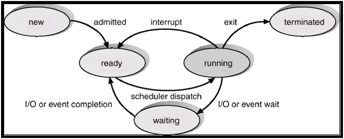
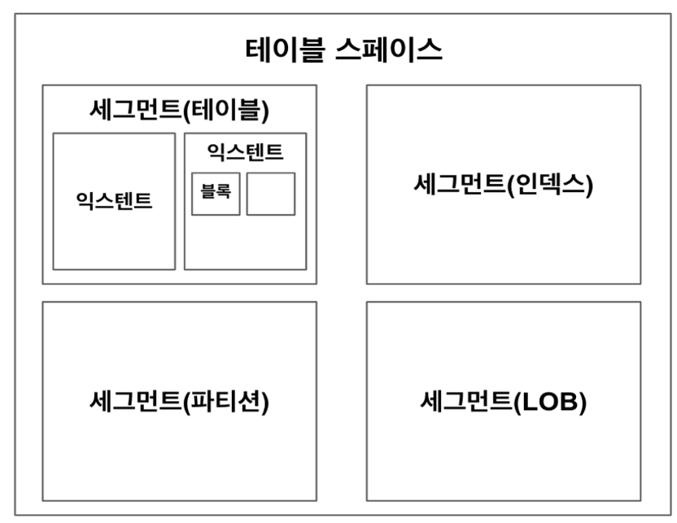
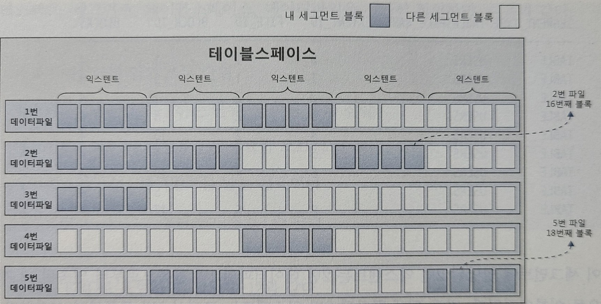
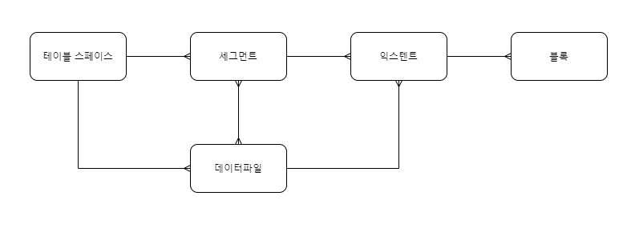

# 데이터 저장 구조 및 I/O 메커니즘

- 프로세스는 실행 중인 프로그램이며 생명주기를 가짐.
- 여러 프로세스가 하나의 CPU를 공유할 수 있지만 특정 순간 하나의 프로세스만 CPU를 사용할 수 있어 이런 메커니즘이 필요함.
- 프로세스가 디스크에서 데이터를 읽어야 할 땐 CPU를 OS에 반환하고 수면 상태에서 I/O가 완료되기를 기다림. (대기 큐에서 잠을 자는것)
- I/O Call 속도는 Single Block I/O 기준 평균 10ms정도. (초당 100블록 읽음) 
(스토리지에 따라 다름 SAN 스토리지 초당125 ~ 250블록, SSD 초당 500~1000블록)
- I/O Call 때문에 디스크 경합이 심해지면 대기 시간도 늘어남, 결국 디스크 I/O가 SQL 성능을 좌우 함.

### 데이터베이스 저장 구조

- 데이터 저장시 테이블스페이스를 생성해야 함.
- 테이블 스페이스 - 세그먼트 - 익스텐트 - 블록 순.
- 데이터 파일: 디스크 상의 물리적인 OS 파일
  
- 테이블 스페이스: 세그먼트를 담는 컨테이너, 여러 개의 데이터 파일(디스크 상의 물리적인 OS 파일)로 구성  
- 세그먼트: 테이블, 인덱스처럼 데이터 저장공간이 필요한 오브젝트. 테이블, 인덱스 생성시 데이터를 어떤 테이블스페이스에 저장할지를 지정. 
파티션 구조가 아니라면 테이블도 하나의 세그먼트, 인덱스도 하나의 세그먼트임. 
파티션 구조라면 각 파티션이 하니의 세그먼트가 된다. 
LOB 컬럼은 그 자체가 하나의 세그먼트를 구성해 자신이 속한 테이블과 다른 별도 공간에 값을 저장.  
- 익스텐트: 공간을 확장하는 단위. 테이블이나 인덱스에 데이터를 입력하다가 공간이 부족하면 해당 오브젝트가 속한 테이블스페이스로부터 익스텐트를 추가로 할당받음. 
익스텐트는 연속된 블록들의 집합. 
세그먼트 공간 부족시 익스텐트를 추가로 할당받지만, 세그먼트에 할당된 모든 익스텐트가 같은 데이터파일에 위치하지 않음. 
테이블스페이스를 여러 데이터파일로 구성하면, 파일 경합을 줄이기 위해 DBMS가 데이터를 가능한 여러 데이터파일로 분산해서 저장하기 때문. 
익스텐트내 블록은 인접한 연속된 공간이지만, 익스텐트끼리는 연속된 공간이 아님.  

- 블록: 사용자가 입력한 레코드를 실제로 저장하는 공간 데이터 블록. (DB2, SQL Server는 블록 대신 페이지라는 용어 사용) 
한 블록은 하나의 테이블이 독점, 한 블록에 저장된 레코드는 모두 같은 테이블 레코드. 
한 익스텐트도 하나의 테이블이 독점. 
 

#### DBA (Data Block Address)
- 데이터 블록은 디스크 상에서 몇 번 데이터파일의 몇 번째 블록인지를 나타내는 자신만의 고유 주소값을 갖는데 이것이 DBA.
- 데이터를 읽고 쓰는 단위가 블록이므로 데이터를 읽으려면 DBA부터 확인해야 함.
- 인덱스를 이용해 테이블 레코드를 읽을 때는 인덱스 ROWID를 이용. ROWID는 DBA + 로우 번호(블록내 순번)으로 구성되어 이를 분해하면 읽어야 할 테이블 레코드가 저장된 DBA를 알 수 있다.
- 테이블 스캔시 테이블 세그먼트 헤더에 저장된 익스텐트 맵을 이용. 
익스텐트 맵을 통해 각 익스텐트의 첫 번째 블록 DBA를 알 수 있음.
- 익스텐트는 연속된 블록 집합이므로 테이블 스캔시 첫 번째 블록 뒤에 연속해서 저장된 블록을 읽으면 된다.
