# 인덱스
인덱스 탐색 과정은 수직적 탐색과 수평적 탐색 2단계로 이루어짐<br>
DB 테이블에서 데이터를 찾는 방법은 2가지<br>
- 테이블 전체를 스캔
- 인덱스를 이용.
<br><br>

##### 인덱스 튜닝의 두 가지 핵심요소
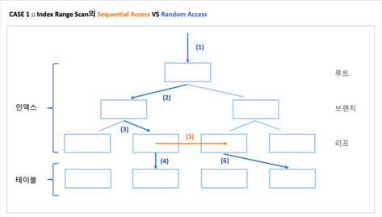
<br>
인덱스 스캔이 성능에 미치는 영향이 좀 더 커 조금 더 중요.

인덱스 스캔 과정에서 발생하는 비효율을 줄이는 것 중요<br>
-> 인덱스 스캔 효율화 튜닝<br>
-> 인덱스 스캔량을 줄임<br>
<br>
테이블 액세스 횟수를 줄이는 것 중요<br>
-> 랜덤 액세스 최소화 튜닝<br>

DB 성능이 느린 이유는 디스크 I/O 때문<br>
읽어야 할 데이터량이 많고, 그 과정에 디스크 I/O가 발생할 때 느리다<br>
IOT, 클러스터, 파티션, 테이블 Prefetch, Batch I/O등 랜덤 I/O를 극복하기 위해 고안됨.


#### 인덱스 구조
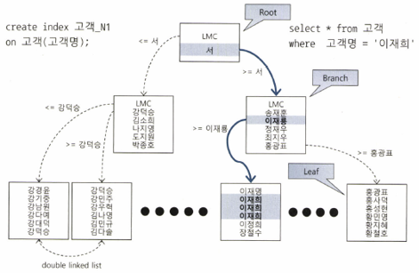
<br>
DBMS는 일반적으로 B*Tree 인덱스를 사용M<br>
루트와 브랜치 블록에 있는 각 레코드는 하위 블록에 대한 주소값을 가짐<br>
키 값은 하위 블록에 저장된 키값의 범위를 나타냄<br>
루트, 브랜치 블록에는 키값을 갖지 않는 특별한 레코드가 있음(LMC)<br>
LMC는 자식 노드 중 가장 왼쪽 끝에 위치한 블록을 가리킴. LMC가 가리키는 주소로 찾아간 블록에는 키값을 가진 첫 번째 레코드보다 작거나 같은 레코드가 저장돼 있다<br>
<br>
리프 블록에 저장된 각 레코드는 키값 순으로 정렬돼 있을 뿐만 아니라 테이블 레코드를 가리키는 주소값, 즉 ROWID를 가짐 인덱스 키값이 값으면 ROWID 순으로 정렬됨 <br>
인덱스를 스캔하는 이유는 검색 조건을 만족하는 소량의 데이터를 빨리 찾고 ROWID를 얻기 위해서임<br>
ROWID는 데이터 블록 주소(DBA, Data Block Address)와 로우 번호로 구성되 있어 이 값을 알면 테이블 레코드를 찾아갈 수 있다<br>
- ROWID = 데이터 블록 주소 + 로우 번호
- 데이터 블록 주소 = 데이터 파일 번호 + 블록 번호
- 블록 번호: 데이터파일 내에서 부여한 상대적 순번
- 로우 번호: 블록 내 순번

인덱스 탐색 과정 : 수직적 탐색, 수평적 탐색<br>
- 수직적 탐색: 인덱스 스캔 시작지점을 찾는 과정
- 수평적 탐색: 데이터를 찾는 과정

#### 인덱스 수직적 탐색
인덱스 스캔 시작지점을 찾는 과정임<br>
루트 블록에서 시작해, 브랜치 블록에 저장된 각 인덱스 레코드는 하위 블록에 대한 주소값을 가짐<br>
때문에 루트에서 시작해 리프 블록까지 수직적 탐색이 가능한 이유임<br>
리프 블록에 도달했으면 조건을 만족하는 첫 번쨰 레코드를 찾음<br>
<br>
수직적 탐색은 조건을 만족하는 첫 번째 레코드를 찾는 과정임

#### 인덱스 수평적 탐색
수직적 탐색을 통해 스캔 시작점을 찾았으면, 조건에 맞는 데이터가 안 나타날 때까지 인덱스 리프 블록을 수평적으로 스캔<br>
인덱스에서 본격적으로 데이터를 찾는 과정<br>
인덱스 리프 블록끼리는 서로 앞뒤 블록에 대한 주소값을 가짐(양방향 연결 리스트)<br>
인덱스를 수평적으로 탐색하는 이유는 조건절을 만족하는 데이터를 모두 찾기 위해서 이고, 또한 ROWID를 얻기 위해서임<br>
조회한 데이터를 인덱스가 모두 갖고 있어 인덱스만 스캔하고 끝날수도 있지만, 일반적으로 인덱스를 스캔하고 테이블도 액세스함 이때 ROWID가 필요함

#### 결합 인덱스 구조와 탐색
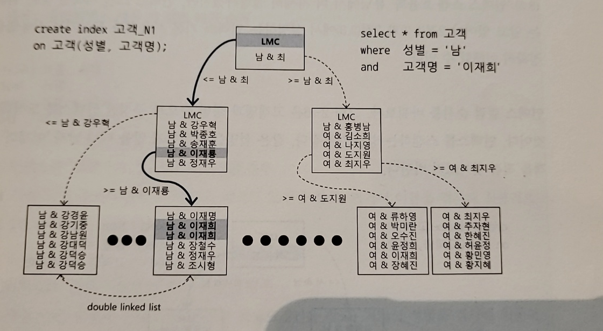
<br>
2개 이상의 컬럼을 결합해 인덱스 만들기 가능<br>
1개 일때와 비슷하게 비교후 리프 블록에서 첫 레코드를 찾음<br>
인덱스 구성 컬럼의 순서를 변경해도 모두 = 조건으로 검색시 블록 I/O 갯수는 같아 성능도 같음<br>
DBMS는 B*Tree 인덱스를 사용하므로 필터링처럼 단계적 구조가 아님<br>
ex) 성별,이름 일시 성별 && 이름 동시에 비교해 찾는다

- Balanced의 의미
    - delete 작업 때문에 인덱스가 불균형 상태에 놓일수도 있어 보이지만 아님
    - B*Tree는 균형 트리로 삽입, 삭제시 블록을 재배치해 루트로부터 리프 블록까지 높이는 항상 같다


#### 인덱스 사용
인덱스 기본 사용법은 Range Scan하는 방법을 의미<br>
결국 인덱스는 컬럼 값을 비교하며 인덱스 블록을 찾기 때문에 인덱스 컬럼을 가공하지 않아야 정상적으로 사용할 수 있다<br>
<br>
리프 블록에서 스캔 시작점을 찾아 거기서부터 스캔하다 중간에 멈추는 것<br>-> Index Range Scan<br>
<br>
인덱스 컬럼을 가공해도 인덱스는 사용할 수 있지만 스캔 시작점을 찾을 수 없어 리프 블록 전체를 스캔<br>-> Index Full Scan
<br>
- Or Expansion
    - use_concat 힌트를 이용해 or 조건절을 union all절의 select들로 SQL 옵티마이저가 변환할 수 있다.

in 조건절도 (in (:no1, :no2)) 또한 인덱스 스캔 시작점을 찾을 수 없지만, Union All 방식으로 작성하면 인덱스 스캔 시작점을 찾을 수 있다<br>
그래서 In 조건절에 대해 SQL 옵티마이저가 In-List Iterator 방식을 사용<br>
(In-List 개수만큼 Index Ragne Scan을 반복 실행게획에 나온다 (INLIST ITERATOR))
<br>
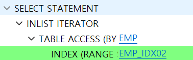
<br><br>

또한 인덱스를 Range Scan 하기 위한 첫 조건은 인덱스 선두 컬럼이 조건절에 있어야 한다
후행 컬럼이 가공되더라도 인덱스 선두 컬럼이 가공되었다면 Range scan은 어느정도 가능<br>
but Range Scan이 항상 성능이 좋은건 아님<br>
인덱스 리프 블록 스캔에서 스캔 범위를 줄여야 어느정도 성능이 좋아짐<br>


#### 인덱스를 이용한 소트연산 생략
인덱스는 테이블과 달리 정렬되어 있기 때문에 소트 연산 생략 효과도 부수적으로 얻게 됨<br>
인덱스 컬럼을 이용해 조회시 order by가 있어도 옵티마이저는 정렬 연산을 따로 수행하지 않음<br>
정렬 연산을 생략할 수 있게 인덱스 구성이 되어 있지 않는다면 sort order by 연산단계 추가됨<br>
- SORT (order by) 실행계획 추가


#### Order by 절에서 컬럼 가공
기본적으로 조건절에 인덱스 컬럼 가공시 인덱스를 정상적으로 사용할수 없다<br>
추가적으로 order by, select-list에서 컬럼을 가공하면 인덱스를 정상적으로 사용할 수 없는 경우도 잇다<br>

Ex1)
PK 인덱스[장비번호 + 변경일자 + 변경순번] 순 구성<br>
아래 SQL도 정렬 연산 생략 가능
```sql
-- 정상
select *
from 상태변경이력
where 장비번호 = 'C'
order by 변경일자, 변경순번


-- 정렬연산 생략 불가능
select *
from 상태변경이력
where 장비번호 = 'C'
order by 변경일자 || 변경순번
```

Ex2) PK 인덱스 [주문일자 + 주문번호]<br>

```sql
-- 정렬연산 생략 되지 않음. -> Order by의 주문번호가 TO_CHAR로 가공된 것이기 때문.
select TO_CHAR(a.주문번호, 'FM00000') 주문번호, a.업체번호, a.주문금액
from 주문 a
where a.주문일자 = :dt
and a.주문번호 > NVL(:next_ord_no, 0)
order by 주문번호

-- -> order by를 테이블의 주문번호로 한다면 정렬연산 생략 가능.
select TO_CHAR(a.주문번호, 'FM00000') 주문번호, a.업체번호, a.주문금액
from 주문 a
where a.주문일자 = :dt
and a.주문번호 > NVL(:next_ord_no, 0)
order by a.주문번호
```


#### select-list에서 컬럼 가공
최대값, 최소값 등을 조회시 인덱스 컬럼을 잘 이용한다면 정렬 연산을 따로 수행하지 않음<br>
다른 경우와 마찬가지로 조회한 컬럼을 가공한다면 정렬연산이 생략되지 않음<br>

#### 자동 형변환
인덱스 컬럼이 형변환 되었다면 옵티마이저는 제대로 인덱스를 이용하지 못한다<br>
decode(a, b, c, d)는 a = b이면 c를 반환, 아니면 d반환. 이때 반환 값의 타입이 인자 c에 의해 결정됨<br>
따라서 c가 문자형이고 d가 숫자형이면 d는 문자형으로 변환됨. 또한 c가 null값이면 varchar2로 취급됨<br>
<br>

### 인덱스 확장기능
#### Index Range Scan
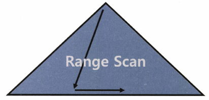<br>
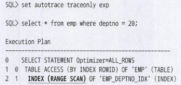<br>
B*Tree 인덱스의 가장 일반적이고 정상적인 ㅎ액세스 방식<br>
인덱스 루트에서 리프 블록까지 수직적 탐색 후 필요한 범위만 스캔<br>
인덱스 선두 컬럼을 가공하지 않은 상태로 조건절에 사용<br>
성능은 인덱스 스캔 범위, 테이블 액세스 횟수를 줄이는데 있음 인덱스만 타면 OK 아님<br>
- INDEX (RANGE SCAN) -> 실행계획

#### Index Full Scan
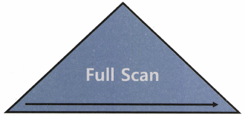<br>
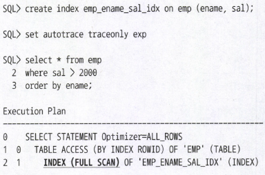<br>
수직적 탐색없이 인덱스 리프 블록을 처음부터 끝까지 수평적으로 탐색하는 방식<br>
데이터 검색을 위한 최적의 인덱스가 없을 때 차선으로 선택됨<br>
대용량 테이블시 Table Full Scan에 따른 부담이 크다면, 옵티마이저는 인덱스 활용을 다시 고려함<br>
데이터 저장공간은 '가로 x 세로' = '컬럼 길이 x 레코드 수'에 의해 결정되므로 인덱스가 차지하는 면적은 테이블보다 훨씬 적음<br>
인덱스 스캔 단계에서 대부분 레코드를 필터링하고 아주 일부만 테이블을 액세스하는 상황이라면, 면적이 큰 테이블보다 인덱스를 스캔하는 쪽이 유리<br>
그럴 때 옵티마이저는 Index full Scan 방식을 선택함<br>
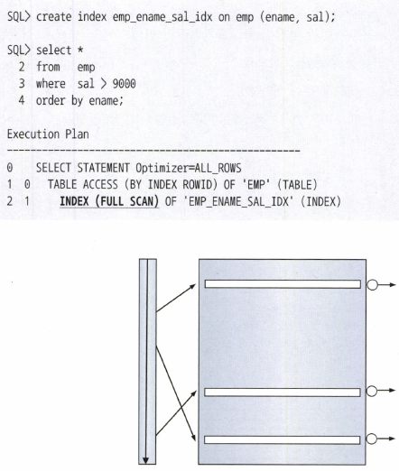<br>
위 경우처럼 전체 중 일부라면 Table Full scan대신 Index Full Scan을 통한 필터링이 효화적<br>
<br>
Index Full Scan도 인덱스 컬럼 순으로 정렬되어 있어 order by 연산 생략 가능<br>
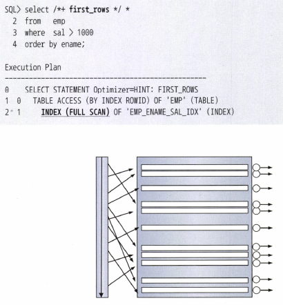<br>
위 경우 대부분의 컬럼이 선택되기 때문에 Table Full Scan이 유리<br>
위 경우는 힌트를 주어 옵티마이저 모드를 바꿧음<br>

### Index Unique Scan
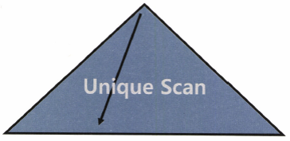<br>
<br>
수직적 탐색만으로 데이터를 찾는 스캔 방식<br>
Unique 인덱스를 = 조건으로 탐색하는 경우에 작동<br>
Unique 인덱스 컬럼은 중복 값이 없게 DB가 관리해줌<br>
Unique 컬럼을 = 조건으로 뎅터를 1건 찾는 순간 더 이상 탐색이 필요 없음<br>
Unique 인덱스라고 해도 범위검색 조건(between, 부등호, like)로 검색하면 Index Range Scna으로 처리됨<br>

#### Index Skip Scan
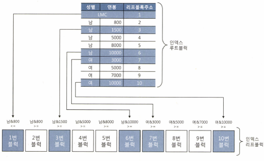<br>
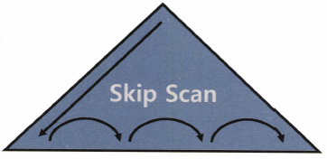<br>
오라클은 인덱스 선두 컬럼이 조건절에 없어도 인덱스를 활용하는 새로운 스캔 방식 도입 이것<br>
조건절에 빠진 인덱스 선두 컬럼의 Distinct Value 개수가 적고 후행 컬럼의 Distinct Value가 많을 때 유용<br>
Index Skip Scan은 루트 또는 브랜치 블록에서 읽은 컬럼 값 정보를 이용해 조건절에 부합하는 레코드를 포함할 가능성이 잇는 리프 블록만 골라서 액세스하는 스캔 방식<br>
```sql
select * from 사원 where 연봉 between 2000 and 4000;
1번 블록은 남 & 800 이하인 레코드 -> 남보다 작은 성별이 있을 수 있어 포함
남 & 800, 남 & 1500 블록은 포함 안시킴.
남 & 1500, 남 & 5000 블록 포함
-> 이런식으로 반복
```
Index Range Scan이 불가능하거나 효율적이지 못한 상황에서 Index Skip Scan은 종종 좋음<br>
but 인덱스는 기본적으로 Index Range Scan을 목표로 설계해야 한다<br>
수행 횟수가 적은 SQL을 위해 인덱스를 추가하는 것이 비효율적일 때 이런 스캔 방식을 차선책으로 활용하는 것이 바람직<br>


#### Index Fast Full Scan
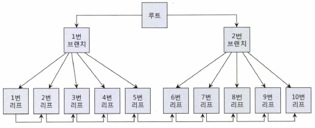<br>
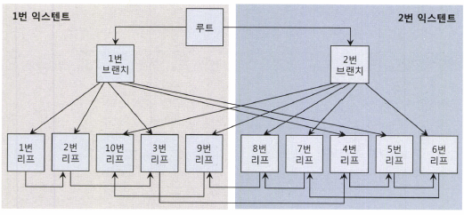<br>
Index Full Scan보다 빠른 스캔<br>
논리적인 인덱스 트리 구조를 무시하고 인덱스 세그먼트 전체를 Multiblock I/O 방식으로 
스캔하기 때문 (관련 힌트 index_ffs, no_index_ffs)<br>
1은 논리적 순서로 배치한 블록, 2는 물리적 순서에 따라 재배치 한것(논리적 순서 화살표)<br><br>
Index Full Scan은 논리적 구조를 따라<br>
루트 -> 브랜치1 -> 1 -> 2 -> 3 -> 4 -> 5 -> 6 -> 7 -> 8 -> 9 -> 10
<br><br>
Index Fast Full Scan은 물리적으로 디스크에 저장된 순서대로 읽음<br>
MultiBlock I/O 방식으로<br>
1 -> 2 -> 10 -> 3 -> 9,  8 -> 7 -> 4 -> 5 -> 6 순으로 읽음<br>
루트, 브랜치 블록도 읽지만 필요 없어 버림<br>
대량의 인덱스 블록을 읽어야 할 때 큰 효과를 발휘해 속도는 빠르지만, 인덱스 구조를 무시하기 때문에 순서대로 정렬되지 않음<br>
쿼리에 사용한 컬럼이 모두 인덱스에 포함돼 잇을 때만 사용할 수 있음<br>
인덱스가 파티션 돼 있지 않더라도 병렬 쿼리가 가능함<br>
병렬 쿼리시 Direct Path I/O 방식을 사용해 I/O 속도가 더 빨라짐

### Index Range Scan Descending
<br>
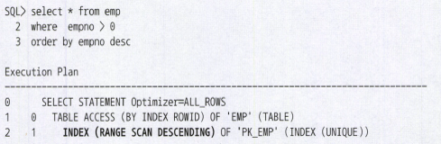<br>
Index Range Scan과 기본적으로 동일한 스캔 방식<br>
인덱스를 뒤에서부터 앞쪽으로 스캔하기 때문에 내림차순으로 정렬된 결과집합을 얻는다는 점만 다름<br>


#### 테이블 랜덤 액세스
<br>
커버링 인덱스가 아니면, 인덱스를 스캔한 후 반드시 테이블을 액세스 (Table Access By Index RowId)<br>
인덱스를 스캔하는 이유는, 검색 조건을 만족하는 소량 데이터를 인덱스에서 빨리 찾고 거기서 테이블 레코드를 찾아가 위한 ROWID를 얻으려고 하는 것<br>
인덱스 ROWID는 논리적 주소로, 포인터가 아님. 디스크 상에서 테이블 레코드를 찾아가기 위한 위치정보를 가짐 (물리적 주소를 가지지 않음)<br>
모든 데이터가 캐싱돼 있더라도 테이블 레코드를 찾기 위해 매번 DBA 해싱과 래치 획득 과정을 반복해야 한다.

##### 메인 메모리 DB와의 차이
메인 메모리 DB는 데이터를 모두 메모리에 띄우고, 일반적인 DBMS는 버퍼캐시 히트가 99%가 되더라도 ROWID로 디스크를 액세스하기 때문에 속도 차이가 난다<br>


#### 인덱스 클러스터링 팩터 (Clustering Factor)
<br>
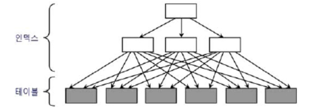<br>
특정 컬럼을 기준으로 같은 값을 갖는 데이터가 서로 모여있는 정도를 의미<br>
예를 들어 [거주지역 = 제주]에 해당하는 데이터가 물리적으로 근접해 있으면 흩어져 있을 때보다 데이터를 찾는 속도가 빠르다<br>

- 인덱스 클러스터링 팩터 효과
    - 검색 효율이 좋다고 했는데, 테이블 액세스량에 비해 블록 I/O가 적게 발생함을 의미
    - 인덱스 ROWID로 테이블 액세스시, 오라클은 래치 획득, 해시 체인 스캔 과정을 거쳐 찾아간 테이블 블록에 대한 포인터를 바로 해제하지 않고 유지 (버퍼 Pinning)
    - 위 상태에서 다음 인덱스 레코드를 읽었는데, 마침 직전과 같은 테이블 블록을 가리킨다면 래치획득, 해시 체인 스캔 과정을 생략하고 바로 테이블 블록을 읽을 수 있다.
    - CF가 안 좋은 인덱스를 사용하면 테이블을 액세스하는 횟수만큼 블록 I/O가 발생한다

#### 인덱스 손익분기점
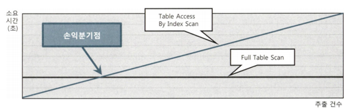<br>
Index Range Scan, Table Full Scan 사이의 속도 분기점 = 인덱스 손익 분기점<br>
<br>
Table Full Scan은 전체 1,000만건 중 1건, 10만건, 1,000만건 조회 차이 거의 없다<br>
Index Range Scan은 추출 건수가 늘면서 인덱스 스캔량이 늘어 영향을 받음<br>
- Table Full Scan은 시퀀셜 액세스, 인덱스 ROWID를 이용한 테이블 액세스는 랜덤 액세스 방식
- Table Full Scan은 MultiBlock I/O, 인덱스 ROWID를 이용한 테이블 인덱스는 Single Block I/O 방식

<br>
이런 요인 때문에 인덱스 손익분기점은 보통 5~20%의 낮은 수준에서 결정<br>
또한 CF에 따라 크게 달라짐. 인덱스 CF가 나쁘면 같은 테이블 블록을 여러번 반복 액세스하면서 논리적 I/O 횟수가 늘고, 물리적 I/O횟수도 늘기 때문<br>
CF가 나쁘면 손익분기점은 5% 미만에서 결정되며 심하면 1% 미만으로 낮아짐<br>
CF가 좋으면 90% 수준까지 올라가기도 함<br>

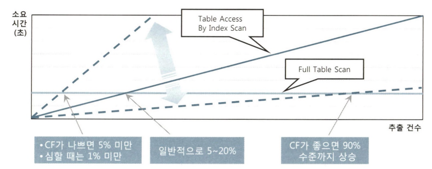<br>

- 인덱스 손익분기점과 버퍼캐시 히트율
    - 일반적으로 5~20% 수준 손익분기점은 10만 건 이네, 많아야 100만건 이내 테이블 적용
        1,000만건 큰 테이블에선 손익분기점이 더 낮아짐
    - 예를 들어 10만 건 테이블 10%는 10,000 건. 10,000건 정도면 버퍼캐시에서 데이터를 찾을 가능성이 어느 정도 있다 이 정도 크기의 테이블이면 인덱스 컬럼 기준으로 값이 같은 테이블 레코드가 근처에 모여 있을 가능성이 있다<br>
    따라서 인덱스를 스캔하면서 테이블을 액세스하다 보면 어느 순간부터 테이블 블록을 캐시에서 찾게 됨
    - 1,000만 건에서 10%면 100만 건. 조회 건수가 늘수록 데이터를 버퍼캐시에서 찾을 가능성이 작아짐. 캐시 히트율은 극히 낮을 수 밖에 없다
    - 게다가 1,000만 건 정도 테이블은 같은 테이블 레코드가 근처에 모여 있을 가능성이 매우 작다<br>
    때문에 거의 모든 데이터를 디스크에서 읽게 됨
    - 10,000건만 넘어도 시퀀셜 액세스와 Multiblock I/O 방식, Table Full Scan 방식으로 읽는 게 빠를 수 있다

#### 인덱스 구조 테이블
테이블을 인덱스 구조로 생성하는 테이블<br>
오라클 -> IOT (Index-Organized Table)
MS Server 


#### 인덱스 접근 Example
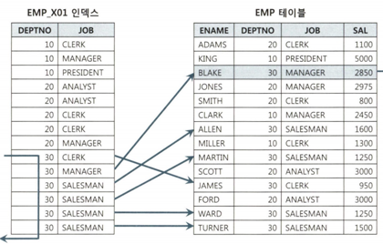<br>
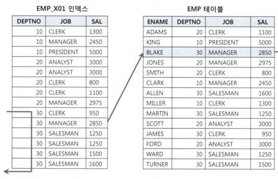<br>
1번의 경우 6번 테이블 랜덤 액세스<br>
2번의 경우 1번 테이블 랜덤 액세스<br>


### 인덱스 스캔 효율화
인덱스 구조에서 루트, 브랜치 블록에는 키 값을 갖지 않는 LMC라는 레코드가 있음<br>
LMC 레코드는 자식 노드 중 가장 왼쪽 끝에 위치한 블록을 가리킴<br>
<br>

인덱스 탐색 예시<br>

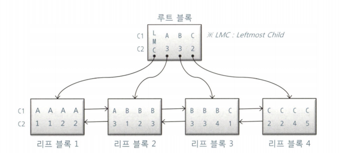<br>
```sql
-- 예시 1
WHERE C1 = 'B'
```
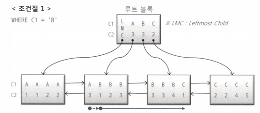<br>
C1 = 'B'인 첫 레코드를 찾고, 'C'를 만나는 순간 스캔을 멈춤<br>

```sql
-- 예시 2
WHERE C1 = 'B'
AND C2 = 3
```
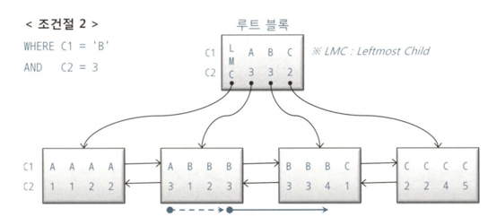<br>
수직적 탐색을 통해 C1 = 'B'이고 C2 = 3인 첫 번째 레코드를 찾고, C1='B'인 레코드 중에서 C2=4인 레코드를 만나는 순간 스캔을 멈춤<br>
C1, C2 조건절 모두 스캔 시작과 끝 지점을 결정하는 데 중요한 역할을 함(스캔량을 줄임)


```sql
-- 예시 3
WHERE C1 = 'B'
AND C2 >= 3
```
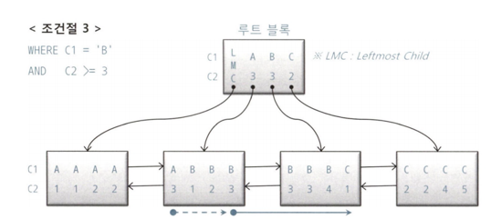<br>
수직적 탐색을 통해 C1='B'이고 C2>=3인 첫 번째 레코드를 찾고,<br>
C1='C'인 레코드를 만날 때까지 스캔하다가 멈춤<br><br>
C2 >= 조건절이 스캔을 멈추는 데는 역할을 전혀 못하지만, <br>
이 조건절로 인해 조건절1과 스캔 시작점이 달라짐<br>
부등호 조건이지만 수직적 탐색 과정에 사용됨으로써<br>
스캔 시작점을 결정하는 데 중요한 역할을 함(스캔량을 줄임)


```sql
-- 예시 4
WHERE C1 = 'B'
AND C2 <= 3
```
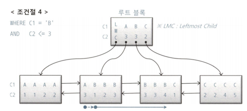<br>
수직적 탐색을 통해 C1 = 'B"인 첫 번째 레코드를 찾고,<br>
스캔하다가 C2 > 3인 첫 번째 레코드를 만나는 순간 스캔을 멈춤<br>
C2 <= 3 조건절은 수직적 탐색 과정에 전혀 쓰이질 않음<br>
스캔 시작점을 결정하는 데 역할을 못했지만, 스캔을 멈추는 데는 중요한 역할을 함(스캔량을 줄임)

```sql
-- 예시 5
WHERE C1 = 'B'
AND C2 BETWEEN 2 AND 3
```
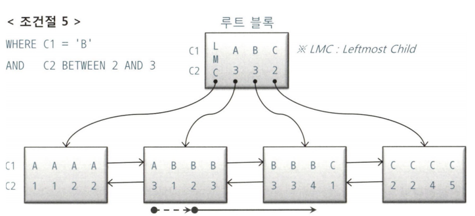<br>
수직적 탐색을 통해 C1='B'이고 C2 >= 2인 첫 번째 레코드를 찾고,<br>
C2 < 3인 첫 번째 레코드를 만나는 순간 스캔을 멈춤<br>
C1, C2 조건절 모두 스캔 시작, 끝 지점을 결정하는데 역할을 함(스캔량을 줄임)

```sql
-- 예시 6
WHERE C1 BETWEEN 'A' AND 'C'
AND C2 BETWEEN 2 AND 3
```
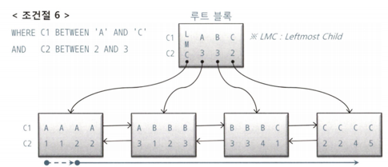<br>
수직적 탐색을 통해 C1 >= 'A"이고 C2 >=2인 첫 번째 레코드에서 스캔을 시작하고,<br>
C1='C'이고 C2=3인 레코드보다 값이 큰 레코드를 만나는 순간 스캔을 멈춤<br>
C1 조건절은 스캔 시작, 끝 지점을 결정하는 데 중요한 역할을 했지만, C2는 그렇지 못함<br>
맨 앞 C1='A'인 구간과 맨뒤 C1='C' 구간에서는 어느 정도 역할을 했지만,<br>
중간 C1='B'구간에서는 전혀 역할을 못 했다.<br>
C2는 스캔량을 줄이는 데 거의 역할을 못함<br>

#### 인덱스 스캔 효율성 측정
<br>
위 트레이스를 분석해 보면, 인덱스를 스캔하고 얻은 레코드는 10개 인데,<br>
그 과정에서 7,463개 블록(cr=7463)을 읽었다는 사실을 알 수 있음<br>
인덱스 리프 블록에는 테이블 블록보다 훨씬 더 많은 레코드가 담김<br>
한 블록당 평균 500개 레코드가 담긴다고 가정하면, 3,731,500(=7463x500)개 레코드를 읽은 셈<br>
10개 데이터를 얻기 위해 300만개 레코드를 읽음 -> 비효율


### 액세스 조건과 필터 조건
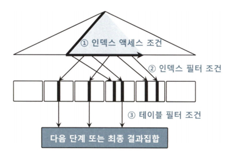<br>
인덱스를 스캔하는 단계에 처리하는 조건절은 액세스 조건, 필터 조건으로 나뉨<br>
<br>
인덱스 액세스 조건: 인덱스 스캔 범위를 결정하는 조건절. 수직적 탐색을 통해 스캔 시작점을 결정하는 데 영향을 미치고, 인덱스 리프 블록을 스캔하다가 어디서 멈출지 결정하는 데 영향을 미치는 조건절<br>
<br>
인덱스 필터 조건 : 테이블로 액세스할지를 결정하는 조건절. 인덱스든, 테이블 풀스캔이든 테이블 액세스 단계에서 처리되는 조건절은 모두 필터 조건<br>
<br>
테이블 필터 조건 : 쿼리 수행 다음 단계로 전달하거나 최종 결과집합에 포함할지를 결정<br>

#### 옵티마이저의 비용계산 원리
비용 = 인덱스 수직적 탐색 비용 + 인덱스 수평적 탐색 비용 + 테이블 랜덤 액세스 비용<br>
= 인덱스 루트와 브랜치 레벨에서 읽는 블록 수 +<br>
인덱스 리프 블록을 스캔하는 과정에 읽는 블록 수 +<br>
테이블 액세스 과정에 읽는 블록 수

### 비교 연산자 종류와 컬럼 순서에 따른 군집성
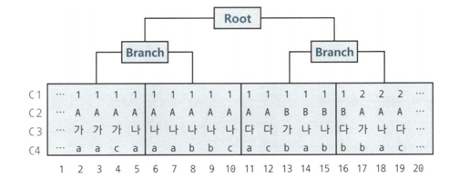<br>
```sql
-- ex1
WHERE C1 = 1
AND C2 <= 'B'
AND C3 = '나'
AND C4 between 'a' and 'b'

--ex2
WHERE C1 between 1 and 3
and C2 = 'A'
and C3 = '나'
and C4 = 'a'
```
선행 컬럼이 모두 = 조건인 상태에서 첫 번째 나타나는 범위검색 조건까지만 만족하는 인덱스 레코드는 모두 연속해서 모여 있지만, <br>
그 이하 조건까지 만족하는 레코드는 비교 연산자 종류에 상관없이 흩어진다<br>

인덱스 스캔 범위를 결정하는 조건절이 인덱스 액세스 조건.<br>
선행 컬럼이 모두 = 조건인 상태에서 첫 번째 나타나는 범위검색 조건이 인덱스 스캔 범위를 결정<br>
ex2처럼 가장 선두 컬럼이 범위검색 조건이면, 그 조건이 스캔 범위를 결정 따라서 이들 조건이 인덱스 액세스 조건임<br>
나머지 인덱스 컬럼 조건은 모두 인덱스 필터 조건<br>


