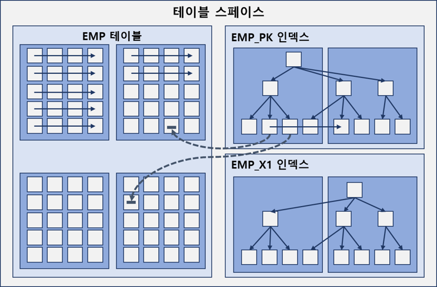
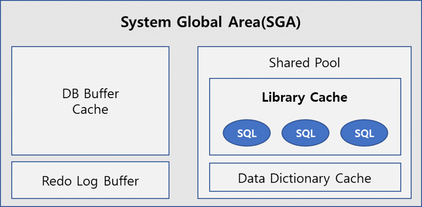
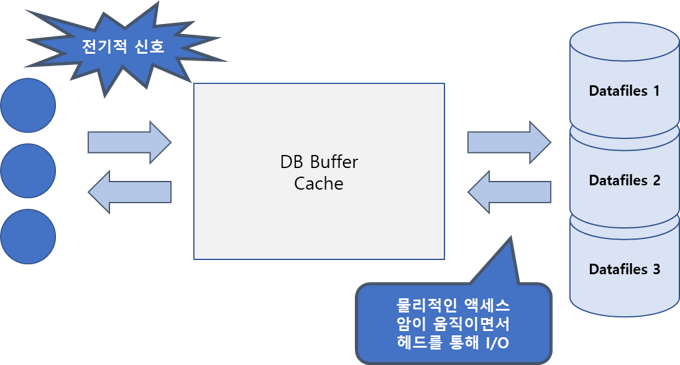
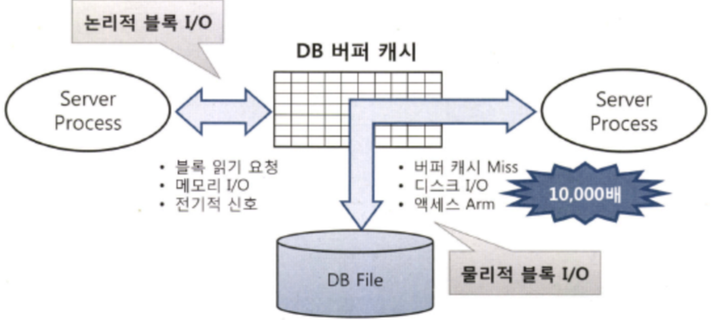
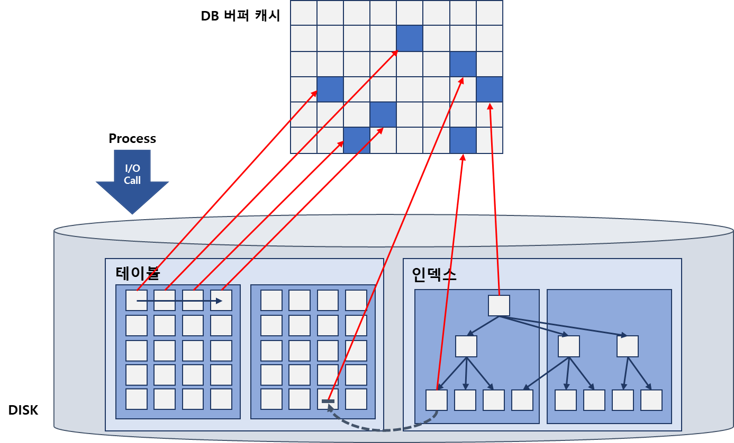
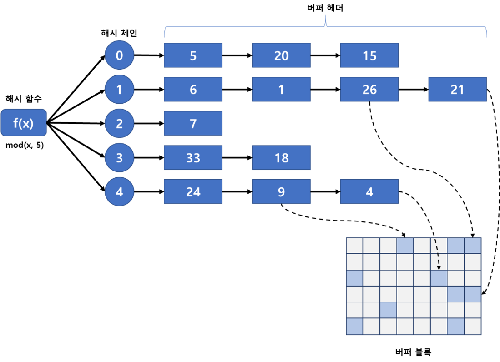

# IO, Storage
### 블록 단위 I/O
- DBMS가 데이터를 읽고 쓰는 단위는 블록.
- 데이터 I/O 단위가 블록이므로 레코드 하나를 읽어도 해당 블록을 통째로 읽는다.
- 설정마다 다르지만 기본적으로 8KB 크기의 블록을 사용하므로 1Byte를 읽기 위해 8KB를 읽는 셈.
- 테이블뿐 아니라 인덱스도 블록 단위로 데이터를 읽고 씀. 

### 시퀀셜 액세스 vs 랜덤 액세스
 

- 시퀀셜 액세스: 논리적 or 물리적으로 연결된 순서에 따라 차례대로 블록을 읽는 방식. 
인덱스 리프 블록은 앞뒤를 가리키는 주소값을 통해 논리적으로 서로 연결돼 있음. 
이 주소 값에 따라 앞, 뒤로 순차적으로 스캔하는 방식이 시퀀셜 액세스. 그림의 실선 
    - 오라클은 세그먼트에 할당된 익스텐트 목록을 세그먼트 헤더에 맵(map)으로 관리.
    - 익스텐트 맵은 각 익스텐트의 첫 번째 블록 주소 값을 가짐.
    - 읽어야 할 익스텐트 목록을 익스텐트 맵에서 얻고, 각 익스텐트의 첫 번째 블록 뒤에 연속해서 저장된 블록을 순서대로 읽으면, Full Table Scan.

- 랜덤 액세스: 논리적, 물리적인 순서를 따르지 않고, 레코드 하나를 읽기 위해 한 블록씩 접근하는 방식. 점선 

### 논리적 I/O vs 물리적 I/O
#### DB 버퍼 캐시
 
- 라이브러리 캐시는 SQL, 실행계획, DB 저장형 함수.프로시저등을 캐싱하는 코드 캐시.
- DB 버퍼 캐시는 데이터 캐시. 디스크에서 읽은 데이터 블록을 캐싱해 같은 블록에 대한 반복적인 I/O Call을 줄이는데 목적이 있음. 
 
- 서버 프로세스와 데이터파일 사이에 버퍼캐시가 있어 데이터 블록을 읽을 땐 항상 버퍼캐시부터 탐색.
- 캐시에서 블록을 찾는다면 프로세스는 I/O Sleep을 하지 않아 빠름. 캐시에서 못 찾아도, I/O Call을 통해 데이터 로드 후 같은 블록을 2번째 읽을 때부터는 캐시에 저장해 잠을 자지 않아도 된다.
- 버퍼 캐시는 공유메모리 영역이므로 같은 블록을 읽는 다른 프로세스도 득을 본다.

#### 논리적 I/O vs 물리적 I/O
 
- 논리적 블록 I/O: SQL 처리 과정에서 발행한 총 블록 I/O. 
일반적으로 메모리상의 버퍼 캐시를 경유하므로 메모리 I/O가 곧 논리적 I/O라고 생각해도 무방. 
(메모리를 경유하지 않는 Direct Path I/O를 고려하면, 논리적 I/O는 메모리 I/O와 Direct Path I/O를 더한 개념)
  
- 물리적 블록 I/O: 디스크에서 발생한 총 블록 I/O. 
SQL 처리 도중 읽어야 할 블록을 버퍼캐시에서 찾지 못할 때만 디스크를 액세스하므로 논리적 블록 I/O 중 일부를 물리적으로 I/O함. 
메모리 I/O는 전기적 신호이고, 디스크 I/O는 액세스 암(Arm)이 물리적 작용이 일어나므로 메모리 I/O에 비해 보통 10,000배 느림. 디스크 경합이 심하면 더 느림.
  
- SQL을 수행하면서 읽은 총 블록 I/O가 논리적 I/O.
- Direct Path Read 방식으로 읽는 경우를 제외하면 모든 블록은 DB 버퍼캐시를 경유해서 읽음. 
따라서 논리적 I/O 횟수는 일반적으로 DB 버퍼캐시에서 블록을 읽은 횟수와 일치함.
- DB 버퍼캐시에서 블록을 찾지 못해 디스크에서 읽은 블록 I/O가 물리적 I/O. 
물리적 I/O는 SQL을 실행할 때마다 다름. (버퍼캐시에 블록이 채워지기 때문)

#### 버퍼캐시 히트율 (BCHR: Buffer Cache Hit Ratio)
- 읽은 전체 블록 중 물리적인 디스크 I/O를 수반하지 않고 곧바로 메모리에서 찾은 비율.

- BCHR = (캐시에서 바로 찾은 블록 수 / 총 읽은 블록 수) x 100 
= ((논리적 I/O - 물리적 I/O) / 논리적 I/O) x 100 
= (1 - (물리적 I/O) / (논리적 I/O)) x 100  
-> 물리적 I/O = 논리적 I/O x (100% - BCHR)

- 결국 논리적 I/O를 줄여야 함. 버퍼 캐시에 적재된 블록은 통제 불가능하기 때문에 
결국 SQL을 튜닝해 읽는 총 블록 개수를 줄이면 된다.

#### Single Block I/O vs Multiblock I/O
 
- Single Block I/O: 한 번에 한 블록씩 요청해서 메모리에 적재하는 방식
    - 인덱스를 이용할 때는 기본적으로 인덱스, 테이블 블록 모두 이 방식.
    - 인덱스 루트 블록을 읽을 때
    - 인덱스 루트 블록에서 얻은 주소 정보로 브랜치 블록을 읽을 때
    - 인덱스 브랜치 블록에서 얻은 주소 정보로 리프 블록을 읽을 때
    - 인덱스 리프 블록에서 얻은 주소 정보로 테이블 블록을 읽을 때.
- MultiBlock I/O: 한 번에 여러 블록씩 요청해서 메모리에 적재하는 방식.
    - 많은 데이터 블록을 읽을 때 효율적.
    - 인덱스를 이용하지 않고 테이블 전체를 스캔할 때 사용.
    - 대용량 테이블을 Full Scan 할 때 Multiblock I/O 단위를 크게 설정하면 성능이 좋아짐.
    - 보통 DBMS 블록 사이즈와 상관없이 OS 단에서 1MB 단위로 수행(OS 마다 다름)
    - 인접 블록을 읽는데 이 인접 블록은 같은 익스텐트에 속한 블록을 의미 
    즉 Multiblock I/O는 익스텐트 경계를 넘지 못함.

#### Table Full Scan vs Index Range Scan
- Table Full Scan: 테이블 전체를 스캔해서 읽는 방식 
시퀀셜 액세스와 Multiblock I/O 방식으로 디스크 블록을 읽음.  
한 블록에 속한 모든 레코드를 한 번에 읽고, 캐시에서 못 찾으면 한 번의 수면으로 인접한 수십 ~ 수백 개 블록을 한꺼번에 I/O하는 메커니즘.
한 번에 많은 데이터를 처리하는 집계용 SQL과 배치 프로그램은 Table Full Scan을 유도하면 성능이 빨라짐. 스토리지 스캔 성능이 좋아지면 성능 좋아짐  

- index Range Scan: 인덱스를 이용해서 읽는 방식 
인덱스에서 일정량을 스캔하면서 얻은 ROWID로 테이블 레코드를 찾아가는 방식 
ROWID는 테이블 레코드가 디스크 상에 어디 저장됐는지 가리키는 위치 정보 
랜덤 엑세스와 Single block I/O 방식으로 디스크 블록을 읽음. 
캐시에서 블록을 못 찾으면, 레코드 하나를 읽기 위해 매번 잠을 자는 I/O 메커니즘 
스토리지 스캔 성능과 관계 미비 

#### 캐시 탐색 메커니즘.
 

Direct Path I/O를 제외한 모든 블록 I/O는 메모리 버퍼캐시를 경유. 
- 인덱스 루트 블록을 읽을 때
- 인덱스 루트 블록에서 얻은 주소 정보로 브랜치 블록을 읽을 때
- 인덱스 브랜치 블록에서 얻은 주소 저보로 리프 블록을 읽을 때
- 인덱스 리프 블록에서 얻은 주소 정보로 테이블 블록을 읽을 때
- 테이블 블록을 Full Scan 할 때.

버퍼캐시는 해시 구조로 관리. 해시 함수로 다양한 알고리즘 사용.
해시함수로 키를 해싱후 해당 키로 버퍼 헤더를 찾고 연결된 해시 체인을 찾아 탐색.
- 같은 입력 값은 항상 동일한 해시 체인(=버킷)에 연결됨
- 다른 입력 값이 동일한 해시 체인(=버킷)에 연결될 수 있음
- 해시 체인 내에서는 정렬이 보장되지 않음.

###### 메모리 공유자원에 대한 액세스 직렬화
버퍼캐시는 SGA 구성요소 이므로 캐싱된 버퍼블록은 모두 공유자원. 누구나 접근 가능. 
하나의 버퍼블록을 2개 이상 프로세스가 동시에 접근하려고 할 때 문제가 발생. (정합성)
한 프로세스씩 순차적 접근을 위해 직렬화 메커니즘이 필요함.
래치(Latch)로 보완.
SGA를 구성하는 서브 캐시마다 별도의 래치가 존재하는데, 버퍼캐시에는 캐시버퍼 체인 래치, 캐시버퍼 LRU 체인 래치등이 작동. 
빠른 DB를 구현하려면 버퍼캐시 히트율을 높여도, 캐시 I/O도 래치 경합 때문에 빠르지 않을 수 있음 
캐시버퍼 체인뿐 아니라 버퍼 블록 자체도 직렬화 메커니즘이 있음 (버퍼 Lock). 이런 직렬화 메커니즘에 대한 캐시 경합을 줄이려면 SQL 튜닝을 통해 쿼리 일량(논리적 I/O) 자체를 줄여야 함.

- 캐시버퍼 체인 레치
    - 데이터를 읽을 때 블록에 대해 해시 체인을 탐색.
    - 해시 체인을 탐색하는 동안 다른 프로세스가 체인 구조를 변경하면 안됌.
    - 이를 막기 위해 해시 체인 래치가 존재.

- 버퍼 Lock
    - 읽고  싶은 블록을 찾았으면 캐시버퍼 체인 래치를 바로 해제해야 함.
    - 래치를 해제한 상태로 버퍼블록 데이터를 읽고 쓰는 도중에 후행 프로세스가 같은 블록에 접근해서 데이터를 읽고 쓴다면 데이터 정합성에 문제가 생길 수 있다.
    - 이를 방지하기 위해 버퍼 Lock을 사용.
    - 캐시버퍼 체인 래치를 해제하기 전에 버퍼 헤더에 Lock을 설정함으로써 버퍼블록 자체에 대한 직렬화 문제를 해결하는 것.
    
    - 로우 Lock을 설정하는 생위도 블록을 변경하는 작업이라 로우 Lock 설정 순간 다른 프로세스가 해당 블록을 읽는다면 문제가 생김.
    - 그뿐 아니라 같은 블록에서 서로 다른 로우를 동시에 읽고 쓰는 경우를 막기 위해서 버퍼 Lock은 필요.