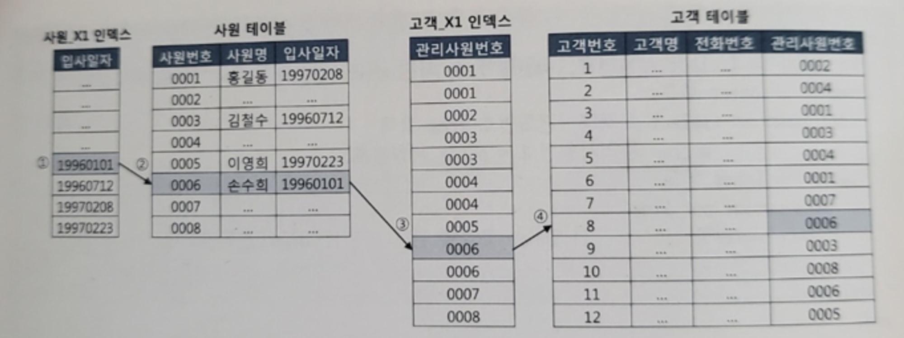
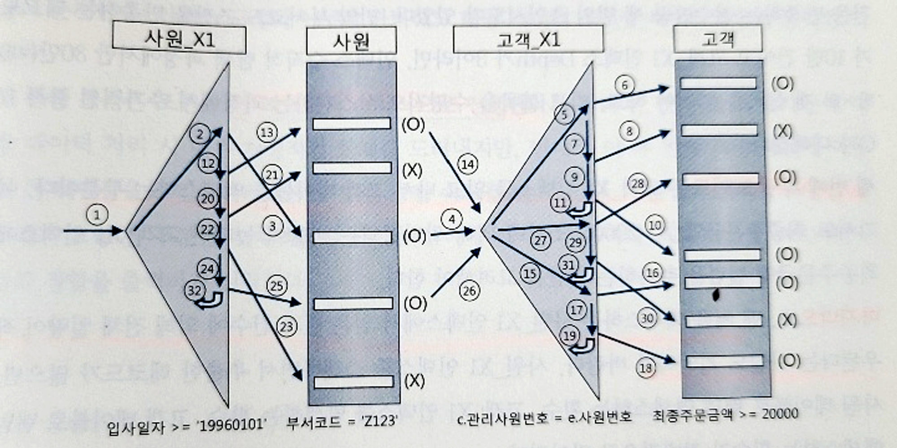
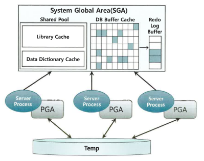
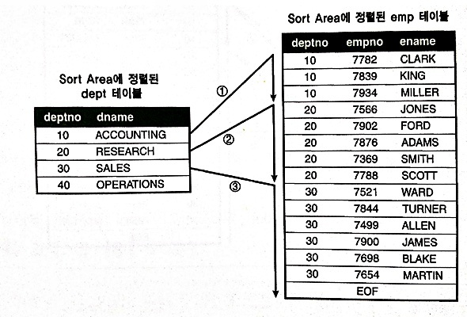
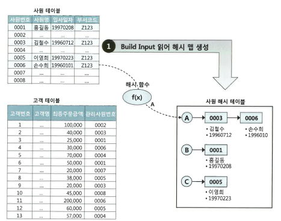
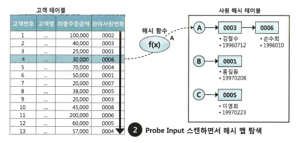

# Join

## NL 조인 기본 메커니즘
```sql
begin
    for outer in (select 사원번호, 사원명 from 사원 where 입사일자 >= ‘19960101’)
        loop -- outer 루프
            for inner in (select 고객명, 전화번호 from 고객 where 관리사원번호 = outer.사원번호)
            loop -- inner 루프
            dbms_output.put_line(outer.사원명 || ‘:’ || inner.고객명 || ‘:’ || inner.전화번호);
        end loop
    end loop
end
```
<br>

NL 조인은 중첩 루프문과 같은 수행 구조를 사용<br>
일반적으로 NL조인은 Outer, Inner 양쪽 테이블 모두 인덱스를 이용<br>
Outer 쪽 테이블은 사이즈가 크지 않으면 인덱스를 이용하지 않을 수 있다<br>
but, Innter 쪽 테이블은 인덱스를 사용해야 한다<br>
Inner 루프에서 데이터 검색시 인덱스를 이용하지 않으면,<br>
Outer 루프에서 읽은 건수만큼 Table Full Scan을 반복하기 때문<br>
위 그림과 같은 방식으로 Outer 테이블의 조건과 Inner 테이블의 컬럼 비교로<br>
조인 조건에 맞는 ROWID를 찾아 해당 컬럼 찾음<br>


### NL 조인 실행계획 제어, 예제
```sql
select /*+ ordered use_nl(c) index(e) index(c)*/ 
	  e.사원번호, e.사원명, e.입사일자,
      c.고객번호, c.고객명, c.전화번호, c.최종주문번호
from 사원 e, 고객 c
where c.관리사원번호  = e.사원번호   -- 1️⃣
and   e.입사일자    >= '19960101'   -- 2️⃣ 
and   e.부서코드     = 'Z123'       -- 3️⃣
and   c.최종주문금액 >= 20000        -- 4️⃣

사원_PK : 사원번호
사원_X1 : 입사일자
고객_PK : 고객번호
고객_X1 : 관리사원번호
고객_X2 : 최종주문금액

0 SELECT STATEMENT
1   NESTED LOOPS
2    TABLE ACCESS BY INDEX ROWID   사원
3     INDEX RANGE SCAN             사원_X1
4    TABLE ACCESS BY INDEX ROWID   고객
5     INDEX RANGE SCAN             고객_X1
```
<br>
ordered 힌트는FROM 절에 기술한 순서대로 조인하라고 옵티마이저에 지시할 때 사용<br>
use_nl은 NL 방식으로 조인하라고 지시<br>
사원 (Outer) -> 고객 (inner) 로 NL 조인하라는 뜻<br>

### NL 조인 튜닝 포인트
NL 조인의 경우 Outer에서 결정된 결과 건수에 의해 Inner테이블과의 조인시도가 결정됨<br>
Outer 테이블 조회 결과가 10만건, Innder 테이블 인덱스 Depth가 3이라면 30만개 블록을 읽어야 함<br>
Outer 테이블 조회결과로<br>
1) Outer 테이블의 랜덤 액세스 횟수 
2) Innder 테이블 인덱스 탐색 횟수
3) Innder 테이블 랜덤 액세스 횟수

가 많아짐<br>

### NL 조인 특징
1. 랜덤 액세스 위주의 조인 방식
2. 한 레코드씩 순차적으로 진행
3. 인덱스 구성 전략이 중요


## 소트 머지 조인
### SGA vs PGA
<br>
SGA: 공유 메모리 영역, 여러 프로세스가 공유할 수 있다.<br>
but 동시에 액세스할 수 없어 직렬화하기 위해 Lock 메커니즘으로서 래치(Latch)가 존재함<br>
데이터 블록과 인덱스 블록을 캐싱하는 DB 버퍼캐시는 SGA의 핵심적인 구성요소이며,<br>
여기서 블록을 읽으려면 버퍼 Lock도 얻어야 한다<br>
오라클 서버 프로세스는 SGA에 공유된 데이터를 읽고 쓰면서 동시에 자신만의 고유 메모리 영역을 가짐<br>
<br>
PGA: 각 오라클 서버 프로세스에 할당된 메모리영역<br>
프로세스에 종속적인 고유 데이터를 저장하는 용도로 사용하며,<br>
할당받은 PGA 공간이 작아 데이터를 모두 저장할 수 없을 때는 Temp 테이블 스페이스를 이용<br>
다른 프로세스와 공유하지 않는 독립적인 메모리 공간이므로 래치 메커니즘이 불필요<br>
따라서 같은 양의 데이터를 읽어도 SGA 버퍼캐시에서 읽을 때보다 훨씬 빠름<br>
<br>

### 기본 메커니즘
소트 머지 조인은 2단계로 진행
1. 소트 단계: 양쪽 집합을 조인 컬럼 기준으로 정렬
2. 머지 단계: 정렬한 양쪽 집합을 서로 머지함

```sql
select /*+ ordered use_merge(c) */
      e.사원번호, e.사원명, e.입사일자,
      c.고객번호, c.고객명, c.전화번호, c.최종주문금액
from 사원 e, 고객 c
where c.관리사원번호 = e.사원번호
and e.입사일자 >= '19960101'
and e.부서코드 = 'Z123'
and c.최종주문금액 >= 20000
```
<br>
1. 아래 조건에 해당하는 사원 데이터를 읽어 조인컬럼인 사원번호 순으로 정렬<br>
정렬한 결과집합은 PGA 영역에 할당된 Sort Area에 저장함<br>
정렬한 결과집합이 PGA에 담을 수 없을 정도로 크면, Temp 테이블스페이스에 저장함<br>

```sql
select 사원번호, 사원명, 입사일자
from 사원
where 입사일자 >= '19960101'
and 부서코드 = 'Z123'
order by 사원번호
```
<br>
2. 아래 조건에 해당하는 고객 데이터를 읽어 조인컬럼인 관리사원번호 순으로 정렬<br>
정렬한 결과집합은 PGA 영역에 할당된 Sort Area에 저장함<br>
정렬한 결과집합이 PGA에 담을 수 없을 정도로 크면, Temp 테이블스페이스에 저장함<br>

```sql
select 고객번호, 고객명, 전화번호, 최종주문금액, 관리사원번호
from 고객 c
where 최종주문금액 >= 20000
order by 관리사원번호
```
<br>
3. PGA(또는 Temp테이블스페이스)에 저장한 사원 데이터를 스캔하면서 PGA(또는 Temp테이블스페이스)에 저장한 고객 데이터와 조인<br>

```sql
begin
      for outer in (select * from PGA에_정렬된_사원)
      loop -- outer loop
            for inner in (select * from PGA에_정렬된_고객 
                          where 관리사원번호 = outer.사원번호)
            loop -- inner loop
                  dbms_output.put_lint(...);
            end loop;
      end loop;
end;
```

<br>
위 수도 코드를 보면 NL조인과 다르지 않음이 보임<br>
사원 데이터를 기준으로 고객 데이터를 매번 Full Scan 하지 않음<br>
고객 데이터가 정렬돼 있으므로 조인 대상 레코드가 시작되는 지점을 쉽게 찾을 수 있고<br>
조인에 실패하는 레코드를 만나는 순간 바로 멈출 수 있다<br>

### 소트 머지 조인이 빠른이유
NL조인은 대량 데이터 조인시 성능이 매우 느림<br>
소트 머지 조인은 Sort Area에 미리 정렬해 둔 자료구조를 이용하다는 점만 다르고 프로세싱은 NL조인과 다르지 않음<br>
but NL조인은 인덱스를 이용한 조인방식이기 때문에 조인 과정에서 액세스하는 모든 블록을<br>
랜덤 액세스 방식으로 건건이 DB 버퍼캐시를 경유해서 읽음<br>
즉, 인덱스든 테이블이든, 읽는 모든 블록에 래치 획득 및 캐시버퍼 체인 스캔 과정을 거침<br>
버퍼캐시에서 찾지 못한 블록은 건건이 디스크에서 읽음<br>
인덱스를 이용하기 때문에 인덱스 손익분기점 한계를 드러냄 이것이 대량 데이터 조인에 NL이 불리한 이유<br>
<br>
but 소트 머지 조인은 양쪽 테이블부터 조인 대상 집합(조건에 맞는 데이터)을<br>
일괄적으로 읽어 PGA에 저장한 후 조인<br>
PGA는 프로세스만을 위한 독립적인 메모리 공간이므로 데이터를 읽을 때 래치 획득 과정이 없음<br>
소트 머지 조인이 대량 데이터 조인에 유리한 이유<br>
소트 머지 조인도 양쪽 테이블로부터 조인 대상 집합을 읽을 때는 DB 버퍼캐시를 경유<br>
이때 인덱스를 이용하기도 함, 이 과정에서 생기는 버퍼캐시 탐색 비용과 랜덤 액세스 부하는<br>
소트 머지 조인도 피할 수 없다<br>

### 소트 머지 조인 주용도
대부분 해시 조인이 빠르기 때문에 소트 머지 조인이 쓰임새는 좀 구림<br>
but 해시 조인은 = 조건이 아닐 때 사용할 수 없다는 단점이 있음<br>
소트 머지 조인은 아래 같은 상황에 주로 사용<br>

- 조인 조건식이 등치(=) 조건이 아닌 대량 데이터 조인
- 조인 조건식이 아예 없는 조인(카테시안 곱)

### 소트 머지 조인 특징
소트 머지 조인은 조인을 위해 실시간으로 인덱스를 생성하는 것과 같음<br>
PGA에 저장한 데이터를 이용하기 때문에 빠름<br>
so 소트 부하만 감수한다면, 건건이 버퍼캐시를 경유하는 NL조인보다 빠름<br>
NL조인은 조인 컬럼에 대한 인덱스 유무에 크게 영향을 받지만<br>
소트 머지 조인은 영향을 받지 않음<br>
스캔 위주의 액세스 방식을 사용한다는 점도 특징<br>
하지만 모든 처리가 스캔 방식으로 이뤄지지 않음<br>
양쪽 소스 집합으로부터 조인 대상 레코드를 찾는 데 인덱스를 이용할 수 있고<br>
그때 랜덤 액세스가 일어난다, 이는 해시 조인도 마찬가지<br>


## 해시 조인
NL조인은 인덱스를 이용한 조인 방식이므로 인덱스 구성에 따른 성능 차이가 심함<br>
인덱스가 완벽해도 랜덤 I/O 때문에 대량 데이터 처리에 불리하고, 버퍼캐시 히트율에 따라 성능의 효율이 많이 다름<br>
소트 머지 조인, 해시 조인은 조인 과정에 인덱스를 이용하지 않아 대량 데이터 조인시 NL조인보다 훨씬 빠르고, 일정한 성능을 보임<br>
<br>
소트 머지 조인은 양 쪽 테이블을 정렬하는 부담이 있음<br>
해시 조인은 그런 부담도 없다<br>

### 기본 메커니즘
1. Build 단계: 작은 쪽 테이블을 읽어 해시 테이블(해시 맵)을 생성
2. Probe 단계: 큰 쪽 테이블을 읽어 해시 테이블을 탐색하면서 조인

```sql
select /*+ ordered use_hash(c) */
      e.사원번호, e.사원명, e.입사일자,
      c.고객번호, c.고객명, c.전화번호, c.최종주문금액
from 사원 e, 고객 c
where c.관리사원번호 = e.사원번호
and e.입사일자 >= '19960101'
and e.부서코드 = 'Z123'
and c.최종주문금액 >= 20000
```
<br>

1. Build 단계: 조건에 해당하는 사원 데이터를 읽어 해시 테이블을 생성<br>
이때 조인컬럼인 사원번호를 해시 테이블 키 값으로 사용<br>
즉 사원번호를 해시 함수에 입력해서 반환된 값으로 해시 체인을 찾고,<br>
해시 체인에 데이터를 연결함<br>
해시 테이블은 PGA 영역에 할단된 Hash Area에 저장함<br>
해시 테이블이 너무 커 PGA에 담을 수 없으면, Temp 테이블 스페이스에 저장
```sql
select 사원번호, 사원명, 입사일자
from 사원
where 입사일자 >= '19960101'
and 부서코드 = 'Z123'
```
2. Prob 단계: 조건에 해당하는 고객 테이터를 하나씩 읽어 앞서 생성한 해시 테이블을 탐색<br>
즉, 관리사원번호를 해시 함수에 입력해서 반환된 값으로 해시 체인을 찾고,<br>
해시 체인을 스캔해서 값이 같은 사원번호를 찾는다<br>
찾으면 조인에 성공한 것이고, 못 찾으면 실패한 것<br>
```sql
select 고객번호, 고객명, 전화번호, 최종주문금액, 관리사원번호
from 고객
where 최종주문금액 >= 20000
```

Builld 단계에서 사용한 해시 함수를 Probe 단계에서도 사용하므로 <br>
같은 사원번호를 입력하면 같은 해시 값을 반환한다<br>
따라서 해시 함수가 반환한 값에 해당하는 해시 체인만 스캔하면 된다<br>

<br>
실제 조인도 Probe 단계는 NL 조인과 다르지 않음<br>

### 해시 조인이 빠른 이유
Hash Area에 생성한 해시 테이블을 이용한다는 점만 다르고<br>
해시 조인도 NL 조인과 프로세싱 자체는 같다<br>
해시 테이블은 PGA 영역에 할당하기 때문에 소트 머지 조인과 마찬가지로 빠르다<br><br>
해시 조인도 Build Input, Probe Input 각 테이블을 읽을 때는 DB 버퍼캐시를 경유<br>
이때 인덱스를 이용하기도 해, 이 과정에서 생기는 버퍼캐시 탐색 비용과 랜덤 액세스 부하는 해시 조인이라도 피할 수 없다<br>

해시 조인, 소트 머지 조인 둘다 PGA에서 처리하지만 대량 데이터 성능 차이는 사전 준비작업에서 나기 시작함<br><br>
소트 머지 조인은 사전 준비작업은 양쪽 집합을 모두 정렬해서 PGA에 담는 작업<br>
PGA는 큰 메모리가 아니라 두 집합 중 하나가 중대형 이상이면, Temp 테이블스페이스, (디스크)에 쓰는 작업을 반드시 수반함<br>
<br>
해시조인은 사전 준비작업은 양쪽 집합 중 어느 한쪽을 읽어 해시 맵을 만드는 작업임<br>
해시 조인은 둘 중 작은 집합을 해시 맵 Build Input을 선택하므로, 두 집합 모두 Hash Area에 담을 수 없을 정도로 큰 경우가 아니면, Temp 테이블스페이스,(디스크)에 쓰는 작업은 전혀 일어나지 않는다<br>

해시 조인은 NL 조인처럼 조인 과정에서 발생하는 랜덤 액세스 부하가 없고<br>
소트 머지 조인처럼 양쪽 집합을 미리 정렬하는 부하도 없다<br>
해시 테이블을 생성하는 비용이 수반되지만, 둘 중 작은 집합을 Build Input으로 선택하므로 대개 부담이 크지 않다<br>
Build Inputㅇ이 PGA 메모리에 담길 때, 인메모리 해시 조인일 때 효과적임<br>
<br>
그렇다고 Build Input이 Hash Area 크기를 초과하면 다른 조인 메서드를 선택하라는 뜻은 아님<br>
설령 Temp 테이블스페이스를 쓰게 되도 대량 데이터 조인시 일반적으로 해시 조인이 가장빠름<br>

#### 해시 테이블에 담기는 정보
해시 테이블에 조인 키값만 저장하는게 아님<br>
그렇다면 래치 획득 과정 없이 PGA에 조인한다는 해시 조인의 장점이 사라짐<br>
조인에 성공한 사원번호에 대한 나머지 정보를 읽으려면 ROWID로 다시 테이블 블록을 액세스해야하기 때문<br>
해시 테이블에는 조인 키값뿐 아니라 SQL에 사용한 컬럼 모두 저장함<br>

### 대용량 Build Input 처리(해시조인)
<br>
두 테이블 모두 대용량 테이블이어서 인메모리 해시 조인이 불가능한 상황<br>
이 경우 2단계로 나눠서 진행, 분할&정복(Divied & Conquer)

<br>
1. 파티션 단계<br>
조인하는 양쪽 집합의 조인 컬럼에 해시 함수를 적용하고,<br>
반환된 해시 값에 따라 동적으로 파티셔닝<br>
독립적으로 처리할 수 있는 여러 개의 작은 서브 집합으로 분할함으로써<Br>
파티션 짝(pair)을 생성하는 단계
양쪽 집합(T1, T2)을 읽어 디스크 Temp 공간에 저장(T1, T2)해야 하므로 인메모리 해시 조인보다 성능이 많이 떨어짐<br>

2. 조인 단계<br>
파티션 단계를 완료하면 각 파티션 짝에 대해 하나씩 조인을 수행<br>
이때, Build Input, Probe Input은 독립적으로 결정<br>
즉, 파티션하기 전 어느 쪽이 작은 테이블이었는지에 상관없이<br>
각 파티션 짝별로 작은 쪽을 Build Input으로 선택하고 해시 테이블을 생성<br>
해시 테이블을 생성하고 나면 반대쪽 파티션 로우를 하나씩 읽으면서 해시 테이블을 탐색함<br>
모든 파티션 짝에 대한 처리를 마칠 때까지 이 과정을 반복<br>

### 해시 조인 선택 기준
NL 조인은 인덱스 재활용이 가능<br>
해시 테이블은 하나의 쿼리를 위해 생성, 조인이 끝나면 바로 소멸하는 자료구조<br>
같은 쿼리를 100개 프로세스가 동시에 수행하면, 해시 테이블도 100개 생김<br>
따라서 수행시간이 짧으면서 수행빈도가 높은 쿼리를 해시 조인으로 처리시<br>
CPU와 메모리 사용률이 크게 증가함<br>
해시 맵을 만드는 과정에 여러 가지 래치 경합도 발생<br>
<br>
해시 조인은 아래 조건 사용<br>
1. 수행 빈도가 낮고
2. 쿼리 수행 시간이 오래 걸리고
3. 대량 데이터 조인시


## 서브쿼리 조인
### 서브쿼리 변환이 필요한 이유
하나의 결과집합을 얻기 위해 SQL을 여러 가지 형태로 표현 가능하고, 성능도 다름<br>
so 옵티마이저는 비용을 평가하고 실행계획을 생성하기에 앞서 사용자로부터 전달받은 SQL을 최적화에 유리한 형태로 변환하는 작업(쿼리 변환)부터 실행함<br>
<br>
쿼리 변환은 옵티마이저가 SQL을 분석해 의미적으로 동일하면서 더 나은 성능이 기대되는 형태로 재작성하는 것<br>
<br>
서브쿼리는 하나의 SQL문 안에 괄호로 묶은 별도의 쿼리 블록을 말함<br>
```sql
select c.고객번호, (
      -- 스칼라 서브쿼리
      select 고객분류명 from 고객분류 where 고객분류코드 = c.고객분류코드
)
from 고객 c, (
      -- 인라인 뷰
      select 고객번호
      from 거래
      where 거래일시 >= trunc(sysdate, 'mm')
      group by 고객번호
) t
where c.가입일시 >= truc(add_months(sysdate, -1), 'mm')
and exists (
      -- 중첩된 서브쿼리
      select 'x'
      from 고객변경이력 h
      where h.고객번호 = c.고객번호
)

```
서브쿼리는 오라클에서 3가지로 분류
1. 인라인 뷰(View) : From 절에 사용한 서브쿼리
2. 중첩된 서브쿼리(Nested Subquery): 결과집합을 한정하기 위해 Where 절에 사용한 서브쿼리<br>
서브쿼리가 메인쿼리 컬럼을 참조하는 형태를 상관관계 있는 서브쿼리
3. 스칼라 서브쿼리(Scalar Subquery): 한 레코드당 정확히 하나의 값을 반환하는 서브쿼리<br>
주로 Select-List에서 사용하지만 몇 가지 예외사항을 제외하면 컬럼이 올 수 있는 대부분 위치에 사용
<br><br>
서브쿼리를 참조하는 메인 쿼리도 하나의 쿼리블록이며, 옵티마이저는 쿼리 블록 단위로 최적화를 수행<br>

### 서브쿼리와 조인
메인쿼리와 서브쿼리 간에는 부모, 자식이라는 종속적이고 계층적인 관계가 존재<br>
서브쿼리는 메인쿼리에 종속되므로 단독으로 실행할 수 없다<br>
메인쿼리 건수만큼 값을 받아 반복적으로 필터링하는 방식으로 실행해야 한다<br>

#### 필터 오퍼레이션
서브쿼리를 필터 방식으로 처리하기 위해 no_unnest 힌트 사용<br>
(서브쿼리를 풀어내지 말고 그대로 수행하라고 지시)
```sql
select c.고객번호, c.고객명
from 고객 c
where c.가입일시 >= trunc(add_months(sysdate, -1), 'mm')
and exists (
      select /*+ no_unnest */ 'x'
      from 거래
      where ...
)
```
필터 오퍼레이션은 기본적으로 NL조인과 처리 루틴이 같다<br>
위 실행계획에서 FILTER를 Nested Loops로 치환하고 처리 루틴을 해석하면 됨<br>
NL조인처럼 부분 범위 처리도 가능
<br><br>
NL조인과의 차이
1. 필터는 메인쿼리의 한 로우가 서브쿼리의 한 로우와조인시 진행을 멈추고,<br>
메인쿼리의 다음 로우를 계속 처리함
2. 필터는 캐싱기능을 가짐. 이는 필터 처리한 결과, 서브쿼리 입력 값에 따른<br>
반환 값을 캐싱하는 기능. 이 기능이 작동하므로 서브쿼리 수행전<br>
항상 캐시부터 확인. 캐시에서 true/false 여부 확인시<br>
서브쿼리를 수행하지 않아도 되 성능을 높이는데 도움이 됨<br>
<br>
캐싱은 쿼리 단위로 이뤄짐. 쿼리를 시작할 때 PGA 메모리에 공간을 할당<br>
쿼리를 수행하면서 공간을 채워나가며, 쿼리를 마치면 공간을 반환<br>
<br>
마지막으로 필터 서브쿼리는 일반 NL조인과 달리 메인쿼리에 종속되므로 <br>
조인 순서가 고정됨. 항상 메인쿼리가 드라이빙 집합<br>

#### 서브쿼리 Unnesting
서브쿼리 Unnesting은 메인과 서브쿼리 간의 계층구조를 풀어 서로 같은 레벨(flat한 구조) 로 만들어 준다는 의미<br>
서브쿼리를 그대로 두면 필터 방식을 사용할 수밖에 없지만, Unnesting 하고 나면 일반 조인문처럼 다양한 최적화 기법을 사용할 수 있다.<br>
<br>
NL 세미 조인은 기본적으로 NL 조인과 같은 프로세스<br>
조인에 성공하는 순간 진행을 멈추고 메인 쿼리의 다음 로우를 계속 처리한다는 점만 다름<br>
오라클 10g부터는 NL 세미조인이 캐싱기능도 갖게 되어 사실상 필터 오퍼레이션과 큰 차이가 없다<br>
<br>
Unnesting된 서브쿼리는 NL 세미조인 외에도 다양한 방식으로 실행될 수 있다<br>
필터방식은 항상 메인쿼리가 드라이빙 집합이지만, Unnesting된 서브쿼리는 메인 쿼리 집합보다 먼저 처리될 수 있다<br>


#### 서브쿼리리 Pushing


### 뷰(View)와 조인
#### 조인 조건 Pushdown

### 스칼라 서브쿼리 조인
