## 소트 연산

### 소트 수행 과정
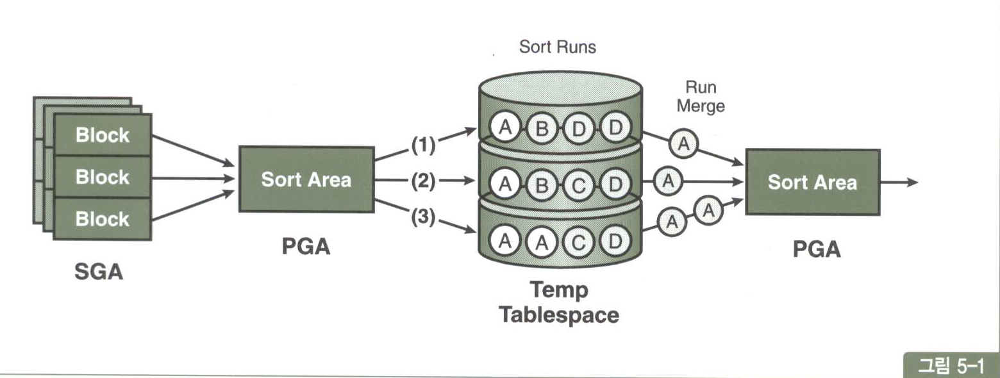<br>
소트는 기본적으로 PGA에 할당한 Sort Area에서 이뤄짐<br>
메모리 공간인 Sort Area가 다 차면, 디스크 Temp 테이블스페이스를 활용<br>
Sort Area에서 작업을 완료할 수 있는지에 따라 소트를 2가지 유형으로 나눔
1. 메모리 소트(In-Memory Sort):<br>
전체 데이터의 정렬 작업을 메모리 내에서 완료하는 것을 말함(Internal Sort)
2. 디스크 소트(To-Disk Sort):<br>
할당받은 Sort Area내에서 정렬을 완료하지 못해 디스크 공간까지 사용하는 경우(External Sort)<br>

소트할 대상 집합을 SGA 버퍼캐시를 통해 읽어들이고, 일차적으로 Sort Area에서 정렬을 시도<br>
Sort Area 내에서 데이터 정렬을 마무리하면 최적이지만, 양이 많을 때는 정렬된 중간집합을 Temp 테이블스페이스에 임시 세그먼트를 만들어 저장<br>
Sort Area가 찰 때마다 Temp 영역에 저장해 둔 중간 단계의 집합을 Sort Run이라고 부름<br>
정렬된 최종 결과집합을 얻으려면 이를 다시 Merge 해야 함<br>
각 Sort Run 내에서는 이미 정렬된 상태이므로 Merge 과정은 어렵지 않음<br>
<br>
소트 연산은 메모리 집약적이고 CPU 집약적<br>
처리할 데이터량이 많을 때는 디스크 I/O까지 발생하므로 쿼리 성능을 좌우하는 매우 중요한 요소<br>
디스크 소트가 발생하는 순간 SQL 수행 성능은 나빠질 수밖에 없음<br>
많은 서버 리소스를 사용하고 디스크 I/O가 발생하는 것도 문제지만<br>
부분범위 처리를 불가능하게 함으로써 앱 성능을 저하시키는 주요인이 됨<br>
될 수 있으면 소트가 발생하지 않도록 SQL을 작성해야 하고, 소트가 불가피하다면<br>
메모리내에서 수행을 완료할 수 있도록 해야 함<br>

### 소트 오퍼레이션
#### 그룹핑 결과 정렬 순서
Sort Group By, Hash Group By 모두 정렬 순서 보장하지 않음<br>
order by를 sql에 명시하면 정렬 보장<br>
소팅 알고리즘을 사용해 그룹핑한 결과집합은 논리적인 정렬 순서를 갖는 연결리스트 구조<br>
사용자가 order by를 명시하면 오라클은 논리적 정렬 순서를 따라 값을 읽어 순서 보장<br>
<br>
물리적으로 저장된 순서는 논리적 순서와 다를 수 있고, order by절이 없다면 오라클은 정렬된 순서로 출력할 의무가 없다<br>
정렬된 그룹핑 결과를 얻고 싶으면 실행계획에 sort group by라고 써있어도 order by를 명시해야함<br>


#### 1) Sort Aggregate
```sql
select sum(sal), max(sal), min(sal), avg(sal) from emp;
```
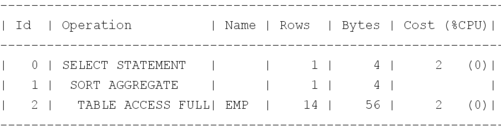<br>
전체 로우를 대상으로 집계를 수행할 때 나타남<br>
'Sort'라는 표현을 사용하지만, 실제로 데이터를 정렬하진 않음<br>
Sort Area를 사용한다는 의미로 이해하면 됨<br>
<br>
데이터를 정렬하지 않고 sum, max, min, avg 값을 구하는 절차<br>
1. Sort Arae에 sum, max, min, count 값을 위한 변수를 각각 하나씩 할당
2. emp 테이블 첫 번째 레코드에서 읽은 sal 값을 sum, maax, min 변수에 저장하고, count 변수에는 1을 저장
3. emp 테이블에서 레코드를 하나씩 읽어 내려가면서 sum 변수에는 값을 누적하고, max, min는 값 대체, count 변수는 null이 아닌 레코드를 만날때마다 1씩 증가
4. 레코드를 다 읽고 각 변수에 값을 출력, avg는 sum값을 count 값으로 나눈 값 출력

#### 2) Sort Order By
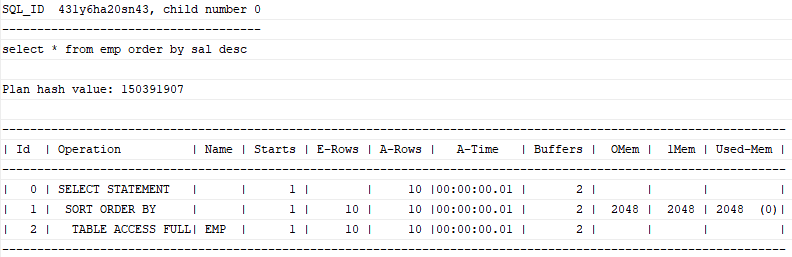<br>
Sort Order by는 데이터를 정렬할 때 나타남

#### 3) Sort Group By
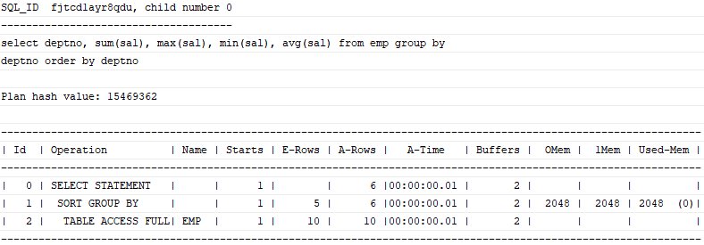<br>
```sql
select deptno, sum(sal), max(sal), min(sal), avg(sal)
from emp
group by deptno
order by deptno;
```
Sort Group By는 소팅 알고리즘을 사용해 그룹별 집계를 수행<br>

Example)
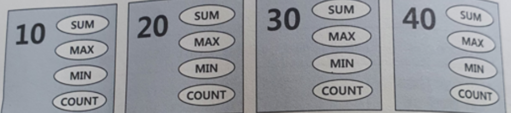<br>
사원(EMP)이 근무하는 회사 가정. 부서는 4개, 부서코드는 10, 20, 30, 40<br>
부서코드별로 통계 정보를 입력할 공간을 할당<br>
Sort Aggregate 방식을 똑같이 사용하면 됨<br>
신규 부서가 나올때 마다 새 메모리 공간을 할당한다고 생각하면 된다<br>
로우가 많아도 읽고 저장하는 메모리 공간은 적어 Temp 테이블스페이스르르 잘 쓰지 않음<br>
<br><br>
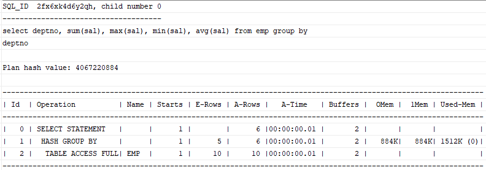<br>
오라클 10gR2 버전부턴 Hash Group by 도 가능<br>
Group by 절 뒤에 Order by절을 명시하지 않으면 대부분 Hash Group By방식으로 처리<br>
Sort Group By는 소트 알고리즘을 사용했다면, Hash Group By는 해싱 알고리즘 사용<br>
읽는 레코드마다 Group By 컬럼의 해시 값으로 해시 버킷을 찾아 그룹별로 집계항목을 갱신<br>
부서(그룹 개수)가 많지 않다면 집계 대상 레코드가 아무리 많아도 Temp 테이블스페이스 쓸일이 없다<br>


#### 4) Sort Unique
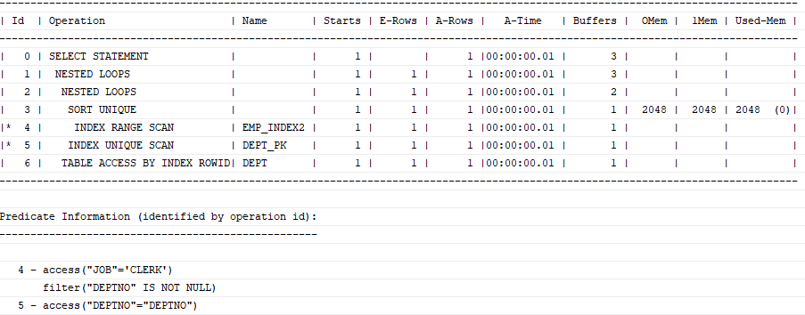<br>
```sql
select /*+ ordered use_no(dept) */ *
from dept
where deptno in (select /*+ unnest */ deptno
                 from emp
                 where job = 'CLERK');
```
서브쿼리 unnesting : 옵티마이저가 서브쿼리를 풀어 일반 조인문으로 변환하는 것<br>
unnesting된 서브쿼리가 M쪽 집합이면, 메인 쿼리와 조인하기 전에 중복 레코드부터 제거해야 한다<br>
이때 Sort Unique 오퍼레이션이 나타난다<br>
PK/Unique 제약 또는 Unique 인덱스를 통해 Unnesting된 서브쿼리의 유일성이 보장된다면<br>
Sort Unique 오퍼레이션은 생략<br>
<br>

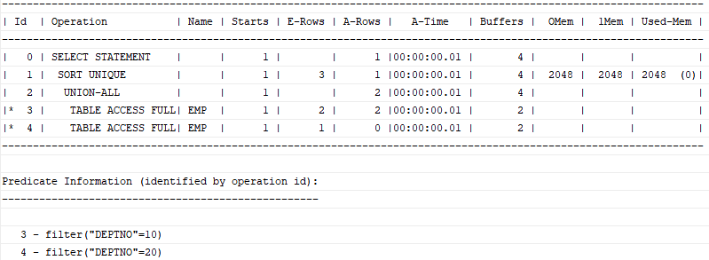<br>
Union, Minus, Intersect 같은 집합(set) 연산자를 사용할 때도 아래와 같이 Sort Unique 오퍼레이션이 나타남<br>
```sql
select job, mgr from emp where deptno = 10
union
select job, mgr from emp where deptno = 20;
```
<br>
```sql
select job, mgr from emp where deptno = 10
minus
select job, mgr from emp where deptno = 20;
```
<br><br>

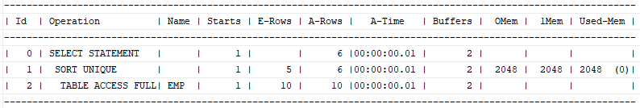<br>
Distinct 연산자를 사용해도 Sort Unique 오퍼레이션이 나타남<br>
```sql
select distinct deptno from emp order by deptno;
```
오라클 10gR2부터는 Distinct 연산에도 Hash Unique 방식을 사용<br>
Group by와 마찬가지로 Order by를 생략할 때 그럼<br>
<br>


#### 5) Sort Join
<br>
```sql
select /*+ ordered use_merge(e) */ *
from dept d, emp e
where d.deptno = e.deptno;
```
소트 머지 조인 수행시 나타남<br>


#### 6) Window Sort
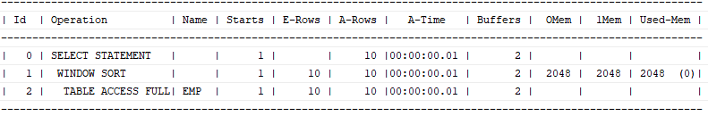<br>
```sql
select empno, ename, job, mgr, sal, avg(sal) over (partition by deptno)
from emp;
```
윈도우 함수(=분석 함수)를 수행할 때 나타남<br>

## 소트가 발생하지 않도록 SQL 작성
### Union vs Union ALL
SQL에 Union을 사용시 옵티마이저는 상단, 하단 두 집합 간 중복을 제거하려고 소트 작업을 수행<br>
Union All은 중복을 확인하지 않고 두 집합을 단순히 결합하므로 소트작업을 수행하지 않음<br>
<br>
### Exists 활용
중복 레코드를 제거할 목적으로 Distinct 연산자를 종종 사용하는데<br>
사용시 조건에 해당하는 데이터를 모두 읽어서 중복을 제거해야 한다<br>
부분범위 처리는 불가능하고, 모든 데이터를 읽는 과정에 많은 I/O가 발생한다<br>
<br>
Exists 서브쿼리는 데이터 존재 여부만 확인하면 되기 때문에 조건절을 만족하는 데이터를 모두 읽지 않음<br>
데이터가 1건이라도 존재하는지 확인하고, Distinct 연산자를 사용하지 않아 테이블에 대한 부분범위 처리도 가능<br>

```sql
select Distinct p.상품번호, p.상품명, p.상품가격, ...
from 상품 p, 계약 c
where p.상품유형코드 = :pclscd
and c.상품번호 = p.상품번호
and c.계약일자 between :dt1 and :dt2
and c.계약구분코드 = :ctpcd

--> Exists 변환

select p.상품번호, p.상품명, p.상품가격, ...
from 상품 p
where p.상품유형코드 = :pclscd
and EXISTS (select 'x' from 계약 c 
where c.상품번호 = p.상품번호
and c.계약일자 between :dt1 and :dt2
and c.계약구분코드 = :ctpcd)
```

Distinct, Minus 연산자를 사용한 쿼리는 대부분 Exists 서브쿼리로 변환 가능<br>


### 조인 방식 변경
아래 SQL에서 인덱스가 [지점ID + 계약일시]순이면 소트 연산 생략 가능<br>
but 해시 조인이기 때문에 Sort Order by가 나타남<br>
```sql
select c.계약번호, c.상품코드, p.상품명, p.상품구분코드, c.계약일시, c.계약금액
from 계약 c, 상품 p
where c.지점ID = :brch_id
and p.상품코드 = c.상품코드
order by c.계약일시 desc
-- Excute Plan -> Sort (Order by) - Hash Join
```
테이블을 NL 조인하도록 조인 방식을 변경하면 소트 연산을 생략할 수 있어<br>
데이터가 많고 부분범위 처리 가능한 상황에서 성능 개선 효과를 얻을 수 있다<br>


## 인덱스를 이용한 소트 연산 생략
인덱스는 항상 키 컬럼 순으로 정렬된 상태를 유지<br>
이를 활용하면 SQL에 Order by, Group by절이 있어도 소트 연산 생략 가능<br>
여기에 Top N 쿼리 특성을 결합하면 빠른 응답 속도를 낼 수 있다<br>
특정 조건 만족 최소값, 최대값 조회도 유용<br>

### Sort Order By 생략
아래 쿼리에선 인덱스 선두 컬럼을 [종목코드 + 거래일시] 순으로 구성하지 않으면, 소트 연산 생략 불가능<br>
```sql
select 거래일시, 체결건수, 체결수량, 거래대금
from 종목거래
where 종목코드 = 'KR123456'
order by 거래일시
```

#### 부분범위 처리를 활용한 튜닝 기법?
부분범위 처리는 쿼리 수행 결과 중 앞쪽 일부를 우선 전송하고 멈추었다 추가 전송을 요청할 때마다 (Fetch Call) 남은 데이터를 조금씩 나눠 전송하는 방식<br>
2-Tier 환경에서(토드, 오렌지)는 많이 활용<br>
3-Tier 환경에서는 클라이언트가 특정 DB 커넥션을 독점할 수 없음(단위 작업 마치면 DB 커넥션 바로 커넥션 풀에 반환)<br>
but 부분범위 처리 원리는 3-Tier 환경에서 Top N 쿼리에 활용 가능

### Top N 쿼리
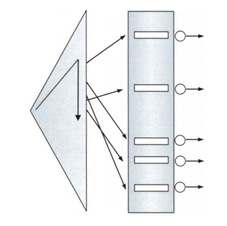<br>
Top N 쿼리는 전체 결과집합 중 상위 N개 레코드만 선택하는 쿼리<br>
SQL 형태만 보면, 인라인 뷰로 정의한 집합을 모두 읽어 거래일시 순으로 정렬한 중간 집합을 만들고<br>
거기서 상위 N개의 레코드를 취하는 형태<br>
소트를 생략할 수 있도록 인덱스를 구성해도 중간집합을 만들어야 해 부분범위 처리는 불가능해 보임<br>
but 옵티마이저는 인덱스가 잘 걸려있다면 소트 연산을 생략해 인덱스 스캔 후 N개 레코드를 읽는 순간 멈춤<br>

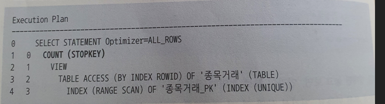<br>

위 실행계획을 보면 Sort Order By 오퍼레이션 대신 Count(STOPKEY)가 있음<br>
이는 조건절에 부합하는 레코드가 많아도 그 중 ROWNUM으로 지정한 건수만큼 레코드를 얻으면 바로 멈춘다는 뜻<br>
Top N StopKey 알고리즘<br>

#### 페이징 처리
3-Tier 환경에서 페이징 처리 표준 패턴<br>
```sql
select *
from (
    select rownum no, a.*
    from (
        /* sql body */
    ) a
    where rownum <= (:page * 10)
)
where no >= (:page - 1) * 10 + 1
```
Top N 쿼리이므로 ROWNUM으로 지정한 건수만큼 겨로가 레코드를 얻으면 바로 멈춤<br>
뒤쪽 페이지로 이동할수록 읽는 데이터량도 많아지지만, 보통 앞쪽 일부 데이터만 확인해 문제가 되지 않음<br>

3-Tier 환경에서 부분범위 처리 활용 일
1. 부분범위 처리 가능한 SQL을 작성. 토드, 오렌지 같은 툴에서 테스트
2. 작성한 SQL 문을 페이징 처리용 표준 패턴 SQL Body 부분에 붙여 넣음

부분범위 처리 가능한 SQL작성은 인덱스 사용 가능하도록 조건절을 구사하고<br>
조인은 NL조인 위주로 처리(룩업을 위한 작은 테이블은 해시 조인 Build Input 처리 가능)<br>
Order by 절이 있어도 소트 연산을 생략할 수 있도록 인덱스 구성을 의미<br>


#### 페이징 처리 ANTI 패턴

