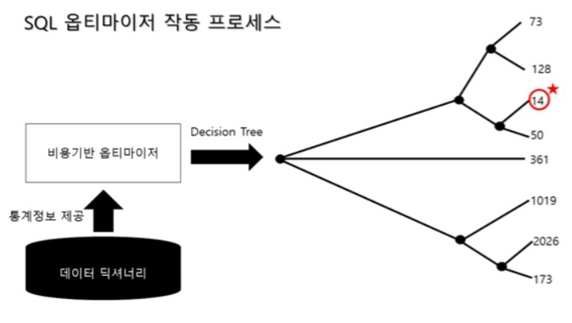
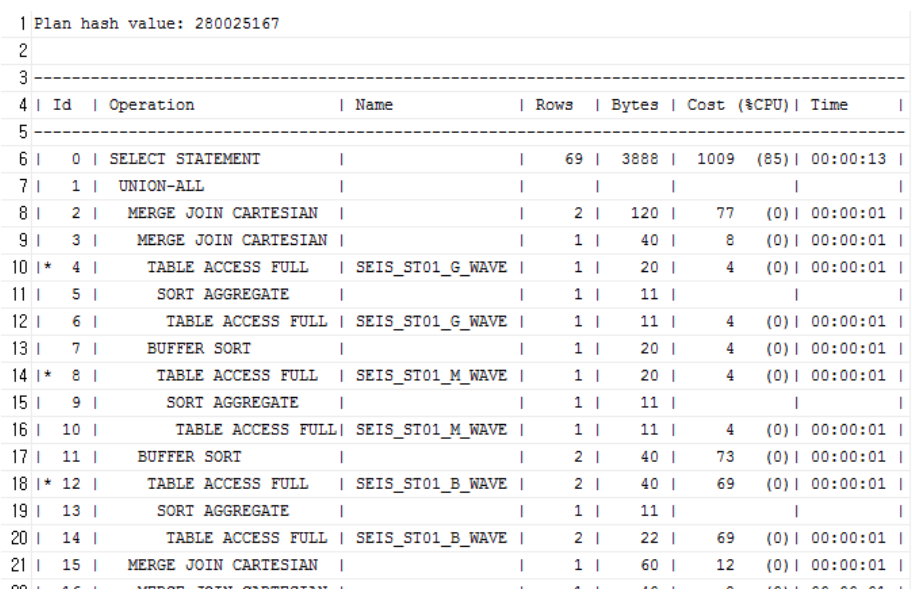
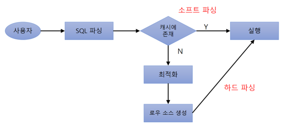

#  SQL 최적화 과정   
- SQL 최적화: DBMS 내부에서 프로시저를 작성하고 컴파일해서 실행가능한 상태로 만드는 전 과정
### 1.  SQL 파싱
- 사용자로부터 SQL을 전달받으면 가장 먼저 SQL 파서(Parser)가 파싱을 진행. <br><br>
1. 파싱 트리 생성
    - SQL문을 이루는 개별 구성요소를 분석해서 파싱 트리 생성
2. Syntax 체크
    - 문법적 오류가 없는지 확인. 사용할 수 없는 키워드를 사용하거나, 순서가 바르지 않거나 누락된 키워드 확인.
3. Semantic 체크
    - 의미상 오류가 없는지 확인. 존재하지 않는 테이블 또는 컬럼을 사용했는지, 사용한 오브젝트에 대한 권한이 있는지 확인.

### 2. SQL 최적화
- 옵티마이저가 실행되는 단계.
- SQL 옵티마이저는 미리 수집한 시스템 및 오브젝트 통계정보를 바탕으로 다양한 실행결로를 생성해서 비교한 후 가장 효율적인 하나를 선택.
- DB 성능을 결정하는 핵심적인 엔진이 옵티마이저.

### 3. 로우 소스 생성
- SQL 옵티마이저가 선택한 실행경로를 실제 실행 가능한 코드 또는 프로시저 형태로 포맷팅하는 단계.
- 로우 소스 생성기 (Row-Source Generator)가 그 역할을 맡음.
---
## SQL 옵티마이저
- SQL 옵티마이저는 사용자가 원하는 작업을 가장 효율적으로 수행할 수 있는 최적의 데이터 액세스 경로를 선택해 주는 DBMS의 핵심 엔진.
<br><br>
- 옵티마이저의 최적화 단계
    1. 사용자로부터 전달받은 쿼리를 수행하는 데 후보군이 될만한 실행계획들을 찾아냄.
    2. 데이터 딕셔너리 (Data Dictionary)에 미리 수집해 둔 오브젝트 통계 및 시스템 통계정보를 이용해 각 실행계획의 예상비용을 산정.
    3. 최저 비용을 나타내는 실행계획을 선택.


<br>
- 이 옵티마이저의 실행경로를 미리 보는 기능이 실행계획.
- SQL 옵티마이저가 생성한 절차를 트리 구조로 표현함.


- 미리보기 기능을 통해 작성한 SQL의 테이블, 인덱스 스캔의 여부 확인 가능.
- 상단 이미지의 Cost에 따라 인덱스가 여러가지 걸려있어도 최소 비용을 선정해 해당 경로를 실행.
<br><br>
- 옵티마이저 힌트
    - 개발자가 직접적으로 데이터 액세스 경로를 바꿀 수 있게 해주는 기능.
    - 힌트 안에 인자 나열시 ','(콤마)를 사용.
    - 힌트와 힌트 사이에 사용하면 안된다
    ```sql
    /*+ INDEX(A A_X01) INDEX(B, B_X03) */ -> 유효
    /*+ INDEX(C), FULL(D) */ -> 첫번째 힌트만 유효
    ```
    <br>

    - 스키마 명까지 명시하면 안됨.
    ```sql
    SELECT /*+ FULL(SCOTT.EMP) */ -> 무효
    FROM EMP
    ```
    <br>

    - Alias 지정시, 힌트에도 Alias 지정. From 절 Alias도 마찬가지.
    ```sql
    SELECT /*+ FULL(EMP) */ -> 무효
    FROM EMP E
    ```

    - 실행계획 부분지정도 가능.
    - 테이블 액세스는 힌트로 지정, 조인 방식, 순서, 다른 테이블 액세스 방식은 옵티마이저가 판단하도록 할 수 있다.
---
<br>

# SQL 공유 및 재사용
### 1. 소프트 파싱 vs 하드 파싱.
- SQL 파싱, 최적화, 로우 소스 생성 과정을 거쳐 생성한 내부 프로시저를 반복 재사용할 수 있도록 캐싱해 두는 메모리 공간을 '라이브러리 캐시(Library Cache)'라고 함.
- 라이브러리 캐시는 SGA 구성요소로 SGA는 서버 프로세스와 백그라운드 프로세스가 공통으로 액세스하는 데이터와 제어 구조를 캐싱하는 메모리 공간이다.


<br>
- 사용자가 SQL문을 전달하면 DBMS는 SQL을 파싱 후 해당 SQL이 라이브러리 캐시에 존재하는지 확인.
- 캐시에서 찾으면 바로 실행, 찾지 못하면 최적화 단계를 거침.
<br><br>
- 소프트 파싱(Soft Parsing)
    - SQL을 캐시에서 찾아 바로 실행단계로 넘어가는 것
- 하드 파싱(Hard Parsing)
    - 캐시에서 찾는데 실패해 최적화 및 로우 소스 생성을 모두 거치는 것.


<br>

- 하드 파싱
    - 경로를 새로 찾는것은 말 그대로 하드한 작업.
    - Ex) 5개 테이블 조인 쿼리문<br>
        조인 순서 고려시 120(=5!) 가지.<br>
        NL 조인, 소트 머지 조인, 해시 조인등 조인 방식 선택<br>
        스캔 방식 선택<br>
        테이블 당 인덱스 선택<br>
    등.. 여러 결정요소가 존재.
    <br><br>
    - 옵티마이저 사용 정보
        - 테이블, 컬럼, 인덱스 구조에 관한 기본 정보
        - 오브젝트 통계: 테이블 통계, 인덱스 통계, (히스토그램을 포함한) 컬럼 통계
        - 시스템 통계: CPU 속도, Single Block I/O 속도, MultiBlock I/O 속도 등..
        - 옵티마이저 관련 파라미터
    <br><br>
    - 위와 같이 무수한 경로를 도출하고 효율성을 판단하는 작업은 무겁다.
    = 데이터베이스 처리 과정 대부분은 I/O 작업에 집중되지만, 하드 파싱은 CPU를 많이 소비하는 몇 안되는 작업 중 하나이다.
    - 라이브러리 캐시를 통해 이런 작업을 줄임.
### 2. 바인드 변수
- 이름없는 SQL 문제
    - 사용자 정의 함수/프로시저, 트리거, 패키지 등은 생성할 때부터 이름을 가짐.
    - 컴파일한 상태로 딕셔너리에 저장되며, 사용자가 삭제하지 않는 한 영구적으로 보관됨.
    - 실행할 때 라이브러리 캐시에 적재해 여러 사용자가 공유하면서 재사용.
    - but SQL은 이름없이 전체 SQL 텍스트가 이름 역할을 함.
        - 딕셔너리에 저장하지않음.
        - 처음 실행시 최적화 과정을 거쳐 동적으로 생성한 내부 프로시저를 라이브러리 캐시에 적재해 여러 사용자가 공유하면서 재사용.
        - 캐시 공간이 부족하면 버려졌다가 다시 실행시 똑같은 최적화 과정을 거쳐 캐시에 적재됨.
    - SQL은 SQL 자체가 이름이기 떄문에 텍스트 중 작은 부분이라도 수정되면 그 순간 다른 객체가 새로 탄생하는 구조. (SQL ID를 사용해도 마찬가지 그냥 내부 매핑임)
        - 일회성 SQL, 무효화된 SQL도 있어 모두 영구 저장하지 않도록 함.
- 공유 가능 SQL
    - 라이브러리 캐시에서 SQL을 찾는 키는 'SQL문 그 자체'이므로 아래는 모두 다른 SQL
    ```sql
    SELECT * FROM emp WHERE empno = 7900;
    select * from EMP where EMPNO = 7900;
    select * from emp where empno = 7900;
    ...
    ```
    - "SELECT * FROM CUSTOMER WHERE LOGIN_ID = '" + login_id + "'";
        - 이 쿼리 문 String은 login_id 마다 새로운 sql을 생성해 라이브러리 캐시에 적재되기 때문에 CPU 사용률이 급격히 올라갈 것.
        - 이 방식을 login_id를 매개변수로 받는 프로시저 하나로 재사용하는 방법이 바인드 변수.
        ```java
        String sql = "SELECT * FROM CUSTOMER WHERE LOGIN_ID = ?";
        sql.setString(1, login_id);
        ...
        ```
        - -> 라이브러리 캐시 조회시 sql 하나만 생성<br>
            select * from customer where login_id = :1
---